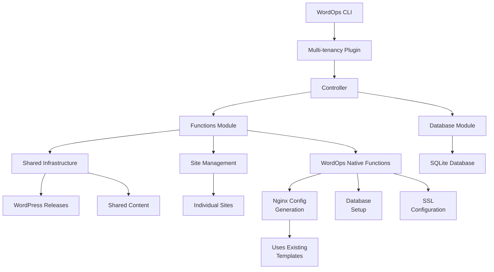

# WordOps Multi-tenancy Plugin - Complete Documentation (v2.0)

**THE DEFINITIVE SOURCE OF TRUTH FOR WORDPRESS MULTI-TENANCY ON WORDOPS**

## Table of Contents
1. [Overview](#overview)
2. [Architecture](#architecture)
3. [Installation](#installation)
4. [Configuration](#configuration)
5. [Commands Reference](#commands-reference)
6. [File Structure](#file-structure)
7. [How It Works](#how-it-works)
8. [API Reference](#api-reference)
9. [Database Schema](#database-schema)
10. [Troubleshooting](#troubleshooting)
11. [Development Guide](#development-guide)
12. [Performance Optimization](#performance-optimization)
13. [Security Considerations](#security-considerations)
14. [Migration Guide](#migration-guide)
15. [FAQ](#faq)
16. [Implementation Notes](#implementation-notes)

---

## Overview

The WordOps Multi-tenancy Plugin enables efficient WordPress hosting by sharing a single WordPress core installation across multiple sites. This dramatically reduces disk usage, simplifies updates, and maintains consistency across all sites.

### Key Benefits

- **90% Disk Space Savings**: One WordPress core serves all sites
- **Instant Updates**: Update WordPress once, all sites get it immediately
- **Atomic Deployments**: Zero-downtime updates with instant rollback
- **Native WordOps Integration**: Uses existing WordOps functions and templates
- **No Custom Templates**: Works perfectly with WordOps' existing nginx templates
- **Full Feature Compatibility**: All cache types, SSL, and PHP versions supported
- **Baseline Enforcement**: Automatic plugin/theme activation across all sites
- **Production Ready**: Comprehensive error handling and recovery

### Design Philosophy

This plugin is designed for scenarios where:
- A single administrator manages all sites
- All sites use the same plugin set
- Consistency across sites is important
- Disk space and update efficiency matter
- Isolation between sites is not required

### What Makes This Implementation Special

- **No custom nginx templates needed** - Uses WordOps' existing templates
- **Native integration** - Not a wrapper, but a true WordOps plugin
- **Transparent to nginx** - Symlink structure works seamlessly
- **Full compatibility** - All WordOps features work unchanged

---

## Architecture

### High-Level Architecture

```
┌─────────────────────────────────────────────────────────────┐
│                        WordOps Core                          │
├─────────────────────────────────────────────────────────────┤
│                   Multi-tenancy Plugin                       │
│  ┌──────────────┬──────────────┬──────────────────────┐    │
│  │  Controller  │   Functions   │     Database        │    │
│  │ (multitenancy.py) │ (multitenancy_functions.py) │ (multitenancy_db.py) │    │
│  └──────────────┴──────────────┴──────────────────────┘    │
├─────────────────────────────────────────────────────────────┤
│              Integration with WordOps Native Functions       │
│  ┌────────────────────────────────────────────────────┐    │
│  │ • setupdatabase() - Database creation              │    │
│  │ • Nginx config via modular includes (no setupdomain) │ │
│  │ • WOAcme() - SSL certificate management           │    │
│  │ • WOService() - Service management                │    │
│  └────────────────────────────────────────────────────┘    │
├─────────────────────────────────────────────────────────────┤
│                    Shared Infrastructure                     │
│  ┌────────────────────────────────────────────────────┐    │
│  │  /var/www/shared/                                  │    │
│  │  ├── current -> releases/wp-YYYYMMDD-HHMMSS       │    │
│  │  ├── releases/                                     │    │
│  │  │   ├── wp-20250127-120000/  (WordPress core)    │    │
│  │  │   └── wp-20250127-140000/                      │    │
│  │  ├── wp-content/                                   │    │
│  │  │   ├── plugins/     (Shared plugins)            │    │
│  │  │   ├── themes/      (Shared themes)             │    │
│  │  │   ├── mu-plugins/  (Baseline enforcer)         │    │
│  │  │   └── languages/   (Shared translations)       │    │
│  │  └── config/                                       │    │
│  │      └── baseline.json (Version control)          │    │
│  └────────────────────────────────────────────────────┘    │
├─────────────────────────────────────────────────────────────┤
│                      Individual Sites                        │
│  ┌────────────────────────────────────────────────────┐    │
│  │  /var/www/example.com/                             │    │
│  │  ├── wp-config.php    (Site-specific config)      │    │
│  │  ├── htdocs/                                       │    │
│  │  │   ├── index.php    (Entry point)               │    │
│  │  │   ├── wp -> /var/www/shared/current (Symlink)  │    │
│  │  │   └── wp-content/                               │    │
│  │  │       ├── plugins -> ../shared/plugins         │    │
│  │  │       ├── themes -> ../shared/themes           │    │
│  │  │       ├── uploads/  (Site-specific)            │    │
│  │  │       └── cache/    (Site-specific)            │    │
│  │  ├── logs/                                         │    │
│  │  └── conf/nginx/                                   │    │
│  └────────────────────────────────────────────────────┘    │
└─────────────────────────────────────────────────────────────┘
```

### Component Interaction Flow



### Why No Custom Nginx Templates Are Needed

The plugin uses WordOps' modular nginx includes instead of custom templates:

1. **Modular includes architecture** - Uses WordOps' standard `common/` includes (wpfc-php83.conf, wpcommon-php83.conf, etc.)
2. **Symlinks are transparent to nginx** - Nginx follows symlinks normally
3. **Document root structure remains standard** - `/var/www/domain/htdocs` is preserved
4. **All paths resolve correctly** - The `/wp` symlink makes WordPress appear in the expected location
5. **Cache configurations work unchanged** - FastCGI, Redis, etc. all work as designed
6. **Automatic feature updates** - When WordOps improves nginx configs, multitenant sites benefit automatically
7. **Minimal configuration delta** - Only adds a single location block for `/wp` symlink handling

---

## Installation

### Prerequisites

- **Operating System**: Ubuntu 20.04/22.04/24.04, Debian 11/12
- **WordOps**: Version 3.20.0 or higher
- **Dependencies**: WP-CLI, curl, unzip, rsync, jq
- **Permissions**: Root or sudo access
- **Disk Space**: Minimum 2GB free

### Install/Update (Fork)

- This plugin ships with this WordOps fork. To install or update it:

  ```bash
  wo update --force
  ```

### Activation (enable plugin)

After updating, ensure the plugin is enabled via WordOps' plugin config directory:

```bash
sudo mkdir -p /etc/wo/plugins.d
sudo tee /etc/wo/plugins.d/multitenancy.conf >/dev/null <<'EOF'
[multitenancy]
enable_plugin = true
EOF
```

### Verify Installation

```bash
wo multitenancy --help
test -f /etc/wo/plugins.d/multitenancy.conf && echo OK
# Optional: confirm module path (internal plugin)
python3 -c "import wo.cli.plugins.multitenancy as m; print(m.__file__)"
```

### Disable / Uninstall

- Disable plugin: edit `/etc/wo/plugins.d/multitenancy.conf` and set `enable_plugin = false`, or remove that file.
- Remove shared infrastructure and data:

  ```bash
  wo multitenancy remove --force
  sudo rm -rf /var/www/shared
  ```

---

## Configuration

### Configuration File Location

`/etc/wo/plugins.d/multitenancy.conf`

### Configuration Options

```ini
[multitenancy]

# Core Settings
shared_root = /var/www/shared           # Root directory for shared infrastructure
keep_releases = 3                        # Number of releases to keep for rollback
php_version = 8.3                        # Default PHP version (7.4, 8.0, 8.1, 8.2, 8.3, 8.4)
admin_email = admin@example.com         # Default admin email
wp_locale = en_US                        # WordPress locale

# Baseline Configuration
baseline_plugins = nginx-helper,redis-cache  # Comma-separated list of plugins
baseline_theme = twentytwentyfour           # Default theme
auto_activate = true                         # Auto-activate baseline on new sites

# Security
disable_file_edit = true                # Disable file editing in WP admin
disable_file_mods = false               # Disable plugin/theme updates from admin

# Performance
wp_memory_limit = 256M                  # WordPress memory limit
wp_max_memory_limit = 512M              # Maximum memory limit
default_cache = wpfc                    # Default cache type (wpfc, wpredis, wprocket, wpce, wpsc, basic)

# SSL
auto_ssl = false                        # Auto-configure Let's Encrypt
enable_hsts = false                     # Enable HSTS by default

# Monitoring
enable_health_check = true              # Run health checks after operations
alert_email =                           # Email for alerts (optional)

# Advanced
min_free_space = 1000                   # Minimum free space in MB
db_connect_timeout = 5                  # Database connection timeout (seconds)
db_connect_retries = 3                  # Database connection retry attempts
enable_syslog = true                    # Enable syslog logging
syslog_tag = wo-multitenancy           # Syslog tag
```


### Custom Plugin and Theme Sources

**📍 ALL plugin sources are defined in:** `/etc/wo/plugins.d/multitenancy.conf`

WordOps multi-tenancy supports three plugin/theme sources:

1. **WordPress.org** - Free public plugins (default)
2. **GitHub** - Your custom/private plugins with version control
3. **Direct URLs** - Premium/commercial plugins from any HTTPS source

**Important:** You define plugins in the config file ONLY. Once you run `wo multitenancy init`, all plugins are automatically available to ALL sites. You don't specify plugin sources when creating individual sites.

---

#### Method 1: WordPress.org Plugins (Default)

**Where:** In the `[multitenancy]` section  
**Format:** Comma-separated list

```ini
[multitenancy]
baseline_plugins = nginx-helper,redis-cache,wordfence
baseline_theme = twentytwentyfour
```

---

#### Method 2: GitHub-Hosted Plugins

**Where:** In a NEW `[github_plugins]` section  
**Format:** `slug = username/repository,ref_type,ref`

```ini
[github_plugins]
# Format breakdown:
# slug = repository,ref_type,ref
#   │         │         │      └─ Tag name (v1.0.0) or branch name (main)
#   │         │         └──────── "tag" or "branch"  
#   │         └────────────────── GitHub username/repository
#   └──────────────────────────── Plugin folder name

# Production: Use tags (recommended - stable versions)
my-custom-plugin = mycompany/my-custom-plugin,tag,v1.5.0
analytics-plugin = mycompany/analytics,tag,v2.0.0

# Development: Use branches (gets latest code)
dev-plugin = mycompany/dev-plugin,branch,develop
```

**Use tags for production** (stable versions like v1.5.0, v2.0.0)  
**Use branches for development** (latest code from main, develop, etc.)

---

#### Method 3: Direct URL Plugins

**Where:** In a NEW `[url_plugins]` section  
**Format:** `slug = https://url/to/plugin.zip`

```ini
[url_plugins]
# Format: slug = direct_url_to_zip_file

premium-plugin = https://example.com/downloads/premium-plugin-v3.0.zip
wp-rocket = https://secure.mycompany.com/plugins/wp-rocket.zip
custom-build = https://builds.mycompany.com/latest/plugin.zip
```

**Requirements:**
- ✅ Must be HTTPS (not HTTP)
- ✅ Must end with .zip
- ✅ Must be accessible from your server

---

#### GitHub-Hosted Themes

**Where:** In a NEW `[github_themes]` section (same format as GitHub plugins)

```ini
[github_themes]
corporate-theme = mycompany/corporate-theme,tag,v1.0.0
```

---

#### Direct URL Themes

**Where:** In a NEW `[url_themes]` section

```ini
[url_themes]
premium-theme = https://example.com/downloads/theme.zip
```

---

#### Complete Configuration Example

**File:** `/etc/wo/plugins.d/multitenancy.conf`

```ini
[multitenancy]
enable_plugin = true
shared_root = /var/www/shared

# Method 1: WordPress.org plugins (comma-separated list)
baseline_plugins = nginx-helper,redis-cache,contact-form-7
baseline_theme = twentytwentyfour

# Method 2: GitHub plugins (one per line in new section)
[github_plugins]
custom-security = mycompany/security-plugin,tag,v2.1.0
analytics-plugin = mycompany/analytics,tag,v1.0.5
dev-tools = username/dev-tools,branch,main

# Method 3: Direct URL plugins (one per line in new section)
[url_plugins]
wp-rocket = https://secure.mycompany.com/plugins/wp-rocket.zip
gravity-forms = https://builds.intranet.local/gravity-forms-latest.zip

# GitHub themes (optional)
[github_themes]
company-theme = mycompany/wordpress-theme,tag,v3.2.0

# URL themes (optional)
[url_themes]
premium-theme = https://example.com/downloads/theme.zip
```

**Workflow:**
1. Edit: `nano /etc/wo/plugins.d/multitenancy.conf`
2. Add your plugins in the appropriate sections above
3. Run: `wo multitenancy init` (downloads all plugins from all sources)
4. Done! All plugins are now available to ALL sites automatically

**Note:** You don't specify plugin sources when creating sites. Just run:
```bash
wo multitenancy create example.com --php83 --wpfc
```
All plugins defined in the config are automatically available.

---

#### GitHub Integration

**Public Repositories:**
No authentication required. Simply specify the repository in your config.

**Private Repositories:**
For private repositories, set a GitHub Personal Access Token:

1. Create a token at https://github.com/settings/tokens
2. Grant `repo` scope (or `public_repo` for public repos only)
3. Set environment variable:

```bash
# Add to /root/.bashrc or /etc/environment

#### GitHub Integration

**Public Repositories:**
No authentication required. Simply specify the repository in your config.

**Private Repositories:**
For private repositories, set a GitHub Personal Access Token:

1. Create a token at https://github.com/settings/tokens
2. Grant `repo` scope (or `public_repo` for public repos only)
3. Set environment variable:

```bash
# Add to /root/.bashrc or /etc/environment
export GITHUB_TOKEN="ghp_your_token_here"
```

**Security Note:** Never commit tokens to config files. Always use environment variables.

**Tag vs Branch:**

- **Use Tags** (Recommended for production):
  - Stable, versioned releases
  - Predictable deployments
  - Easy version tracking
  - Example: `my-plugin = user/repo,tag,v1.5.0`

- **Use Branches** (For development):
  - Continuous integration
  - Testing latest changes
  - Auto-updating from source
  - Example: `my-plugin = user/repo,branch,develop`

#### Direct URL Integration

**When to Use:**
- Premium plugins not in WordPress.org
- Plugins from marketplaces (CodeCanyon, etc.)
- Custom builds from CI/CD
- Internal plugins from company servers

**Security Considerations:**
⚠️ **Important**: Only download from trusted sources!
- Verify HTTPS URLs
- Use authenticated URLs for sensitive plugins
- Consider hosting internally for production
- Validate zip file integrity

#### Best Practices

**Version Management:**
✅ **Do:**
- Use Git tags for production
- Follow semantic versioning (v1.2.3)
- Document version changes in baseline history
- Test updates in staging first

❌ **Don't:**
- Use `latest` or `master` branch in production
- Mix development and production sources
- Skip version numbers

**Organization:**
Group plugins by purpose in your config for better clarity.

**Troubleshooting Custom Sources:**

*GitHub Download Fails:*
- Verify repository exists and is accessible
- Check tag/branch exists
- Test download manually: `curl -L https://github.com/user/repo/archive/refs/tags/v1.0.0.zip -o test.zip`
- For private repos, ensure GITHUB_TOKEN is set
- Check rate limiting (60 requests/hour unauthenticated, 5000/hour authenticated)

*URL Download Issues:*
- Test URL accessibility: `curl -I "https://example.com/plugin.zip"`
- Verify it's actually a zip file: `file plugin.zip`
- Check zip contents: `unzip -l plugin.zip`

---

## Commands Reference

### wo multitenancy init

Initialize the shared WordPress infrastructure.

```bash
wo multitenancy init [--force]
```

**What it does:**
1. Creates directory structure at `/var/www/shared`
2. Downloads WordPress core
3. Seeds baseline plugins and themes
4. Creates MU-plugin for baseline enforcement
5. Sets up configuration files
6. Auto-cleanup old releases (keeps 3 by default)

### wo multitenancy create

Create a new WordPress site using shared core.

```bash
wo multitenancy create <domain> [options]
```

**Options:**
- `--php74|--php80|--php81|--php82|--php83|--php84`: PHP version
- `--wpfc`: WordPress with FastCGI cache
- `--wpredis`: WordPress with Redis cache
- `--wprocket`: WordPress with WP Rocket
- `--wpce`: WordPress with Cache Enabler
- `--wpsc`: WordPress with WP Super Cache
- `--letsencrypt`, `--le`: Configure Let's Encrypt SSL
- `--hsts`: Enable HSTS
- `--dns=<provider>`: DNS provider for wildcard SSL
- `--admin-email=<email>`: Admin email address
- `--admin-user=<username>`: Admin username (default: admin)

**Examples:**
```bash
# Basic WordPress site with PHP 8.3 and FastCGI cache
sudo wo multitenancy create example.com --php83 --wpfc

# WordPress site with SSL (note: use double hyphen --)
sudo wo multitenancy create example.com --php83 --wpfc --le

# WordPress site with SSL and HSTS
sudo wo multitenancy create example.com --php83 --wpfc --letsencrypt --hsts

# WordPress site with Redis cache and wildcard SSL
sudo wo multitenancy create example.com --php83 --wpredis --le --dns=dns_cf
```

**⚠️ Common Syntax Errors:**
- ❌ Wrong: `—le` (em dash)
- ✅ Correct: `--le` (double hyphen)
- ❌ Wrong: `–le` (en dash)
- ✅ Correct: `--le` (double hyphen)

### wo multitenancy update

Update WordPress core and plugins for all shared sites.

```bash
wo multitenancy update [--force]
```

**Process:**
1. Downloads new WordPress version
2. Tests with canary site (unless --force)
3. Atomically switches all sites
4. Cleans up old releases

### wo multitenancy rollback

Rollback to previous WordPress release instantly.

```bash
wo multitenancy rollback [--force]
```

### wo multitenancy status

Display comprehensive status and health check.

```bash
wo multitenancy status
```

### wo multitenancy list

List all sites using shared WordPress core.

```bash
wo multitenancy list
```

### wo multitenancy baseline

Display current baseline configuration.

```bash
wo multitenancy baseline
```


### wo multitenancy baseline add-plugin

Add a plugin to the shared baseline from WordPress.org, GitHub, or a direct URL.

```bash
# From WordPress.org
wo multitenancy baseline add-plugin <slug> [--apply-now]

# From GitHub repository
wo multitenancy baseline add-plugin <slug> --github=user/repo [--tag=v1.0.0] [--branch=main] [--apply-now]

# From direct URL
wo multitenancy baseline add-plugin <slug> --url=https://example.com/plugin.zip [--apply-now]
```

**Options:**
- `--github=user/repo`: Download from GitHub repository
- `--tag=v1.0.0`: Use specific Git tag (recommended for production)
- `--branch=main`: Use specific Git branch (for development)
- `--url=<url>`: Download from direct HTTPS URL
- `--apply-now`: Immediately apply baseline to all sites

**Examples:**
```bash
# Add plugin from WordPress.org
wo multitenancy baseline add-plugin contact-form-7

# Add custom plugin from GitHub with specific tag
wo multitenancy baseline add-plugin my-custom-plugin --github=mycompany/my-plugin --tag=v2.1.0

# Add plugin from GitHub using branch (development)
wo multitenancy baseline add-plugin dev-tools --github=mycompany/dev-tools --branch=develop

# Add premium plugin from direct URL
wo multitenancy baseline add-plugin wp-rocket --url=https://example.com/downloads/wp-rocket.zip

# Add and immediately activate on all sites
wo multitenancy baseline add-plugin my-plugin --github=user/repo --tag=v1.0.0 --apply-now
```

### wo multitenancy baseline add-theme

Add a theme to the shared baseline from WordPress.org, GitHub, or a direct URL.

```bash
# From WordPress.org
wo multitenancy baseline add-theme <slug> [--apply-now]

# From GitHub repository
wo multitenancy baseline add-theme <slug> --github=user/repo [--tag=v1.0.0] [--branch=main] [--apply-now]

# From direct URL
wo multitenancy baseline add-theme <slug> --url=https://example.com/theme.zip [--apply-now]
```

**Examples:**
```bash
# Add theme from WordPress.org
wo multitenancy baseline add-theme astra

# Add custom theme from GitHub
wo multitenancy baseline add-theme corporate-theme --github=mycompany/wp-theme --tag=v1.0.0

# Add premium theme from URL
wo multitenancy baseline add-theme premium-theme --url=https://example.com/theme.zip
```

### wo multitenancy baseline remove-plugin

Remove a plugin from the shared baseline.

```bash
wo multitenancy baseline remove-plugin <slug> [--apply-now]
```

**Example:**
```bash
wo multitenancy baseline remove-plugin old-plugin --apply-now
```

### wo multitenancy baseline remove-theme

Remove a theme from the shared baseline.

```bash
wo multitenancy baseline remove-theme <slug> [--apply-now]
```

### wo multitenancy baseline update-plugin

Update a plugin from its original source (WordPress.org, GitHub, or URL).

```bash
wo multitenancy baseline update-plugin <slug>
```

**What it does:**
1. Reads plugin source from baseline.json metadata
2. Re-downloads from original source:
   - WordPress.org: Gets latest version
   - GitHub: Re-downloads from same tag/branch
   - URL: Re-downloads from same URL
3. Updates last_updated timestamp in baseline.json
4. Suggests testing and applying to sites

**Examples:**
```bash
# Update WordPress.org plugin to latest version
wo multitenancy baseline update-plugin contact-form-7

# Re-download GitHub plugin (same tag)
wo multitenancy baseline update-plugin my-custom-plugin

# Re-download from URL
wo multitenancy baseline update-plugin premium-plugin
```

**Note:** For GitHub plugins, this re-downloads from the same tag/branch. To upgrade to a new tag, use `remove-plugin` then `add-plugin` with the new tag.

### wo multitenancy baseline update-theme

Update the theme from its original source.

```bash
wo multitenancy baseline update-theme
```

**Examples:**
```bash
# Update theme from its source
wo multitenancy baseline update-theme
```

### wo multitenancy baseline apply

Apply the baseline configuration to all sites (activate plugins/theme).

```bash
wo multitenancy baseline apply [--verify-only]
```

**Options:**
- `--verify-only`: Check compliance without making changes

### wo multitenancy remove

Remove multi-tenancy infrastructure (dangerous).

```bash
wo multitenancy remove [--force]
```

---

## File Structure

### Plugin Files

```
# Packaged internal plugin (default in this fork)
/opt/wo/lib/python3.x/site-packages/wo/cli/plugins/
├── multitenancy.py                 # Main controller
├── multitenancy_functions.py       # Core functions (uses WordOps native functions)
└── multitenancy_db.py              # Database operations

# External override location (optional; not required in this fork)
/var/lib/wo/plugins/
├── multitenancy.py
├── multitenancy_functions.py
└── multitenancy_db.py

/etc/wo/plugins.d/
└── multitenancy.conf               # Activation/configuration file

# NO CUSTOM TEMPLATES - Uses WordOps existing nginx templates:
# - /var/lib/wo/templates/wpfc.mustache (FastCGI cache)
# - /var/lib/wo/templates/wpredis.mustache (Redis cache)
# - /var/lib/wo/templates/wp.mustache (Basic WordPress)
# etc.
```

### Shared Infrastructure

```
/var/www/shared/
├── current -> releases/wp-20250127-140000    # Symlink to active release
├── releases/
│   ├── wp-20250127-120000/                   # Old release
│   └── wp-20250127-140000/                   # Current release
│       ├── index.php
│       ├── wp-admin/
│       ├── wp-includes/
│       ├── wp-*.php
│       └── wp-content -> ../../wp-content    # Symlink to shared content
├── wp-content/
│   ├── plugins/                              # Shared plugins
│   ├── themes/                               # Shared themes
│   ├── mu-plugins/                           # Must-use plugins
│   │   └── wo-baseline-enforcer.php         # Baseline enforcement
│   └── languages/                            # Translations
├── config/
│   └── baseline.json                         # Baseline configuration
└── backups/                                  # Release backups
```

### Individual Site Structure

```
/var/www/example.com/
├── wp-config.php                             # Site configuration
├── .admin_pass                               # Admin password (secure)
├── htdocs/
│   ├── index.php                            # Entry point
│   ├── wp -> /var/www/shared/current        # Symlink to WordPress
│   └── wp-content/
│       ├── plugins -> /var/www/shared/wp-content/plugins      # Symlink
│       ├── themes -> /var/www/shared/wp-content/themes        # Symlink
│       ├── mu-plugins -> /var/www/shared/wp-content/mu-plugins # Symlink
│       ├── languages -> /var/www/shared/wp-content/languages   # Symlink
│       ├── uploads/                         # Site-specific uploads
│       └── cache/                           # Site-specific cache
├── logs/
│   ├── access.log
│   └── error.log
└── conf/nginx/
    # Uses standard WordOps nginx configuration
```

---

## How It Works

### 1. Initialization Process

```python
def init():
    # 1. Create shared directory structure
    create_directory_structure()
    
    # 2. Download WordPress to timestamped release
    release_name = download_wordpress_core()
    
    # 3. Download baseline plugins and themes
    seed_plugins_and_themes(config)
    
    # 4. Create baseline configuration
    create_baseline_config(config)
    
    # 5. Create MU-plugin for enforcement
    create_mu_plugin()
    
    # 6. Switch symlink to new release
    switch_release(release_name)
    
    # 7. Save configuration to database
    MTDatabase.save_config(app, {
        'current_release': release_name,
        'baseline_version': 1
    })
```

### 2. Site Creation Process

```python
def create_site():
    # 1. Validate domain
    validate_domain()
    
    # 2. Create site directories
    create_site_directories()
    
    # 3. Setup database using WordOps function
    db_info = setupdatabase()  # Native WordOps function
    
    # 4. Create symlinks to shared infrastructure
    create_shared_symlinks()
    
    # 5. Generate wp-config.php
    generate_wp_config()
    
    # 6. Generate nginx using modular includes (no templates)
    MTFunctions.generate_nginx_config(app, domain, php_version, cache_type, site_root)
    
    # 7. Install WordPress with WP-CLI
    install_wordpress()
    
    # 8. Apply baseline configuration
    apply_baseline()
    
    # 9. Configure SSL if requested
    setup_ssl()  # Uses WordOps WOAcme
```

### 3. Update Process (Atomic)

```python
def update():
    # 1. Download new WordPress to new release directory
    new_release = download_wordpress_core()

    # 2. Test with first site (canary)
    if not test_canary_site():
        abort_update()

    # 3. Backup current release reference
    backup_current_release()

    # 4. Atomically switch symlink
    switch_release(new_release)  # Instant for all sites

    # 5. Clear all site caches globally (fast - ~2 seconds for any number of sites)
    clear_all_caches()  # Uses 'wo clean --all' - clears FastCGI + Redis + OpCache

    # 6. Cleanup old releases
    cleanup_old_releases(keep=3)
```

### 4. Nginx Configuration Generation

```python
@staticmethod
def generate_nginx_config(app, domain, php_version, cache_type, site_root):
    """Generate nginx configuration using WordOps modular includes.
    Replaces template rendering via setupdomain()."""

    nginx_conf = f"/etc/nginx/sites-available/{domain}"

    # Build configuration content using modular includes
    config_content = MTFunctions.generate_modular_nginx_config(
        domain, site_root, php_version, cache_type
    )

    # Ensure directories exist, write file, set perms, and validate
    MTFunctions.ensure_nginx_directories(app, domain, site_root)
    with open(nginx_conf, 'w') as f:
        f.write(config_content)
    os.chmod(nginx_conf, 0o644)
    MTFunctions.test_nginx_config_file(app, nginx_conf)
    return nginx_conf
```

### 5. Baseline Enforcement

The MU-plugin (`wo-baseline-enforcer.php`) automatically:
- Checks baseline version on each request
- Activates required plugins if not active
- Switches to required theme if different
- Updates itself when baseline version changes


### 6. Baseline Version Management & Auto-Increment

The multitenancy system uses an **automatic version control system** to ensure all sites stay synchronized with the baseline configuration.

#### How Baseline Versioning Works

**Baseline Version (`baseline.json`):**
- Each baseline configuration has a version number
- **Version automatically increments when plugins or theme change**
- All sites track their current baseline version
- Stored in `/var/www/shared/config/baseline.json`

**Site Version (`wo_mt_baseline_version` option):**
- Each site stores its current baseline version in the WordPress database
- MU-plugin checks baseline version on every WordPress init
- If site version < baseline version, updates are applied automatically

#### Automatic Version Increment Behavior

When you run `wo multitenancy init --force` or modify the baseline:

**First Time (No existing baseline.json):**
```bash
wo multitenancy init
```
- Creates `baseline.json` with version 1
- No comparison needed (file doesn't exist yet)
- All new sites start at version 1

**No Configuration Changes:**
```bash
wo multitenancy init --force
```
- Compares current config with existing baseline
- Plugins unchanged, theme unchanged
- **Version stays the same** (efficient!)
- Existing sites don't need to re-process
- Output: `No changes detected, keeping version 1`

**With Configuration Changes:**
```bash
# Edit config file
nano /etc/wo/plugins.d/multitenancy.conf
# Add: [github_plugins]
#      new-plugin = user/new-plugin,branch,main

wo multitenancy init --force
```
- Detects plugin list or theme changed
- **Automatically increments version** (e.g., 1 → 2)
- Existing sites auto-update on next load
- Output: `✅ Baseline configuration changed - incrementing version to 2`

#### How Sites Auto-Update (Zero-Touch Propagation)

**Existing Sites Workflow:**
When a site with version 1 loads and baseline is version 2:

1. User visits site or WP-CLI command runs
2. MU-plugin (`wo-baseline-enforcer.php`) runs on WordPress init
3. Checks: site v1 < baseline v2?
4. **Automatically activates new plugins/theme**
5. Updates site version to 2 in database
6. **No manual intervention needed!**

**Real-World Example Workflow:**

```bash
# Day 1: Initial setup
wo multitenancy init
wo multitenancy create site1.com --php83 --wpfc
wo multitenancy create site2.com --php83 --wpfc
wo multitenancy create site3.com --php83 --wpfc
# All sites at baseline version 1

# Day 2: Add new plugin to config
nano /etc/wo/plugins.d/multitenancy.conf
# Add to [github_plugins]:
#   analytics-plugin = mycompany/analytics,tag,v1.0.0

wo multitenancy init --force
# Output: ✅ Baseline configuration changed - incrementing version to 2
# baseline.json now at version 2

# Day 2 afternoon: Sites auto-update on next access
# User visits site1.com
# → MU-plugin: site v1 < baseline v2
# → Activates analytics-plugin automatically
# → Updates site1.com to v2

# User visits site2.com
# → Same automatic activation
# → Updates site2.com to v2

# User visits site3.com
# → Same automatic activation
# → Updates site3.com to v2

# Result: All sites now at v2 with analytics-plugin active
# No manual activation commands needed!
```

#### Monitoring Baseline Versions

**Check baseline version:**
```bash
cat /var/www/shared/config/baseline.json | grep version
# Output: "version": 2
```

**Check site's current version:**
```bash
wp option get wo_mt_baseline_version --path=/var/www/example.com/htdocs --allow-root
# Output: 2
```

**Check all sites' versions (batch check):**
```bash
for site in /var/www/*/htdocs; do
  domain=$(basename $(dirname $site))
  if [ -f "$site/wp-config.php" ] && [ "$domain" != "shared" ]; then
    version=$(wp option get wo_mt_baseline_version --path=$site --allow-root 2>/dev/null || echo "N/A")
    echo "$domain: v$version"
  fi
done
```

**Force site to re-process baseline (troubleshooting):**
```bash
wp option update wo_mt_baseline_version 0 --path=/var/www/example.com/htdocs --allow-root
# Site will auto-upgrade to current baseline on next load
```

#### Version Increment Triggers

The baseline version **automatically increments** when:

✅ **Plugin list changes:**
- Added plugins (any source: WordPress.org, GitHub, or URL)
- Removed plugins
- Changed plugin configuration (different repo, tag, or URL)

✅ **Theme changes:**
- Changed `baseline_theme` value
- Different theme specified

❌ **Version stays the same** when:
- Only running `--force` to re-download (no config change)
- No changes to plugin list or theme
- Only updating non-baseline settings
- Re-downloading same plugins from same sources

#### Baseline Configuration Structure

```json
{
  "version": 2,
  "generated": "2025-10-06T15:29:01.191857",
  "plugins": [
    "nginx-helper",
    "woocommerce",
    "plausible-analytics",
    "safe-svg",
    "object-cache-pro",
    "woodmart-core"
  ],
  "plugin_sources": {
    "nginx-helper": {
      "type": "wordpress.org",
      "last_updated": "2025-10-06T15:29:01"
    },
    "woodmart-core": {
      "type": "github",
      "repo": "ximich/woodmart-core",
      "ref_type": "branch",
      "ref": "main",
      "last_updated": "2025-10-06T15:29:01"
    },
    "object-cache-pro": {
      "type": "url",
      "url": "https://example.com/downloads/object-cache-pro.zip",
      "last_updated": "2025-10-06T15:29:01"
    }
  },
  "theme": "woodmart-child",
  "options": {
    "blog_public": 1,
    "default_comment_status": "closed",
    "default_ping_status": "closed"
  }
}
```

**Key Fields:**
- `version`: **Auto-incremented when configuration changes**
- `plugins`: All plugins from all sources (WordPress.org + GitHub + URL)
- `plugin_sources`: Metadata tracking where each plugin comes from
- `theme`: Default theme to activate
- `options`: Default WordPress options

#### Benefits of Auto-Increment System

✅ **Automatic Propagation:**
- Changes apply to all sites automatically
- No manual activation needed on each site
- Sites update on next page load (zero-touch)

✅ **Efficient:**
- Only increments when actually needed
- Sites don't re-process unchanged configurations
- Minimal overhead (single database query per request)

✅ **Consistent:**
- All sites eventually reach the same version
- No sites left behind
- Guaranteed synchronization across infrastructure

✅ **Trackable:**
- Clear version progression (v1 → v2 → v3)
- Easy to identify outdated sites
- Audit trail of configuration changes
- Version number in baseline.json shows change history

✅ **Conflict-Free:**
- First-time init starts at v1 (avoids errors)
- Re-running init without changes doesn't increment
- Only real configuration changes trigger version bump

#### Implementation Details

The auto-increment logic is implemented in the `create_baseline_config()` method:

```python
def create_baseline_config(config):
    # Load existing baseline if present
    existing_baseline = load_existing_baseline()
    
    # Build new baseline from current config
    new_baseline = build_baseline_from_config(config)
    
    if existing_baseline:
        # Compare configurations
        if has_config_changed(existing_baseline, new_baseline):
            # Increment version on change
            new_baseline['version'] = existing_baseline['version'] + 1
            Log.info("Baseline configuration changed - incrementing version to " + 
                    str(new_baseline['version']))
        else:
            # Keep same version if no change
            new_baseline['version'] = existing_baseline['version']
            Log.info("No changes detected, keeping version " + 
                    str(new_baseline['version']))
    else:
        # First time: start at version 1
        new_baseline['version'] = 1
        Log.info("Creating initial baseline configuration (version 1)")
    
    # Save baseline.json
    save_baseline(new_baseline)
```

The MU-plugin (`wo-baseline-enforcer.php`) checks and applies updates:

```php
// Check if site needs baseline update
$site_version = (int) get_option('wo_mt_baseline_version', 0);
$baseline_version = (int) $baseline['version'];

if ($site_version < $baseline_version) {
    // Apply baseline: activate plugins, set theme
    apply_baseline_to_site($baseline);
    
    // Update site version
    update_option('wo_mt_baseline_version', $baseline_version);
    
    error_log("WO Baseline Enforcer: Updated site from v$site_version to v$baseline_version");
}
```


---

## API Reference

### Main Classes

#### WOMultitenancyController

Main controller handling all CLI commands.

```python
class WOMultitenancyController(CementBaseController):
    class Meta:
        label = 'multitenancy'
        stacked_on = 'base'
        stacked_type = 'nested'
```

**Methods:**
- `init()` - Initialize shared infrastructure
- `create()` - Create new shared site
- `update()` - Update WordPress core
- `rollback()` - Rollback to previous release
- `status()` - Display status and health
- `list()` - List shared sites
- `baseline()` - Manage baseline
- `remove()` - Remove infrastructure

#### MTFunctions

Utility functions for multi-tenancy operations.

**Key Methods:**
- `load_config()` - Load plugin configuration
- `generate_nginx_config()` - Generates config via modular includes
- `generate_modular_nginx_config()` - Builds server block with includes
- `create_shared_symlinks()` - Create symlink structure
- `install_wordpress()` - Install WordPress using WP-CLI
- `clear_all_caches()` - Global cache clearing for all sites (fast - ~2 seconds)

#### SharedInfrastructure

Manages shared WordPress infrastructure.

**Key Methods:**
- `download_wordpress_core()` - Download WordPress
- `switch_release()` - Atomic release switching
- `create_baseline_config()` - Create baseline configuration

#### MTDatabase

Database operations using WordOps' SQLite database.

**Key Methods:**
- `initialize_tables()` - Create plugin tables
- `add_shared_site()` - Register shared site
- `get_shared_sites()` - List all shared sites

---

## Database Schema

The plugin extends WordOps' SQLite database (`/var/lib/wo/dbase.db`) with three tables:

### multitenancy_config
```sql
CREATE TABLE multitenancy_config (
    id INTEGER PRIMARY KEY,
    key VARCHAR(255) UNIQUE NOT NULL,
    value TEXT,
    created_at DATETIME DEFAULT CURRENT_TIMESTAMP,
    updated_at DATETIME DEFAULT CURRENT_TIMESTAMP
);
```

### multitenancy_releases
```sql
CREATE TABLE multitenancy_releases (
    id INTEGER PRIMARY KEY,
    release_name VARCHAR(255) UNIQUE NOT NULL,
    wp_version VARCHAR(50),
    is_current BOOLEAN DEFAULT 0,
    created_at DATETIME DEFAULT CURRENT_TIMESTAMP
);
```

### multitenancy_sites
```sql
CREATE TABLE multitenancy_sites (
    id INTEGER PRIMARY KEY,
    domain VARCHAR(255) UNIQUE NOT NULL,
    site_type VARCHAR(50),
    cache_type VARCHAR(50),
    site_path VARCHAR(255),
    php_version VARCHAR(10),
    shared_release VARCHAR(255),
    baseline_version INTEGER DEFAULT 0,
    is_enabled BOOLEAN DEFAULT 1,
    is_ssl BOOLEAN DEFAULT 0,
    created_at DATETIME DEFAULT CURRENT_TIMESTAMP,
    updated_at DATETIME DEFAULT CURRENT_TIMESTAMP
);
```

---

## Troubleshooting

### Plugin Not Loading

```bash
# Check activation (must exist and be enabled)
sudo grep -n "enable_plugin" /etc/wo/plugins.d/multitenancy.conf || echo "missing config"

# Confirm subcommand is registered
wo multitenancy --help | cat

# Confirm internal module is present (packaged plugin)
python3 -c "import wo.cli.plugins.multitenancy as m; print(m.__file__)"

# (Optional) If using external override location
ls -la /var/lib/wo/plugins/multitenancy*.py || true
```

### "unrecognized arguments: —le" or similar SSL errors

This is usually a character encoding issue where em dash (—) or en dash (–) is used instead of double hyphen (--).

**Fix:**
```bash
# Wrong (em dash): —le
# Wrong (en dash): –le
# Correct (double hyphen): --le

# Use the correct syntax:
sudo wo multitenancy create example.com --php83 --wpfc --le
```

### "unrecognized arguments: multitenancy"

```bash
# 1) Ensure activation file exists and enabled
sudo tee /etc/wo/plugins.d/multitenancy.conf >/dev/null <<'EOF'
[multitenancy]
enable_plugin = true
EOF

# 2) Clear Python caches (defensive)
sudo find /opt/wo/lib/python3.*/*site-packages/wo -name __pycache__ -type d -exec rm -rf {} +

# 3) Retry
wo multitenancy --help | cat
```

### Initialization fails with "No such file or directory: '/var/www/shared/releases/wp-XXXXXXXX/wp-includes/wp-includes'"

**Symptoms:** `wo multitenancy init --force` command fails with nested wp-includes path error.

**Root Cause:** The `set_permissions()` function in `SharedInfrastructure` class was following symlinks during directory traversal, causing it to:
1. Walk into the `/var/www/shared/releases/wp-XXX/wp-content` symlink
2. Follow it to `/var/www/shared/wp-content`
3. Encounter nested symlink structures creating recursive/invalid paths

**Fix:** Added `followlinks=False` parameter to `os.walk()` in the `set_permissions()` method.

**Location:** `wo/cli/plugins/multitenancy_functions.py:1649`

**Version Fixed:** v8.2.1 (January 2025)

### Startup errors during initialization

- If you see an `IndentationError` or `AttributeError: 'WOApp' object has no attribute 'app'` during initial load, update to the latest fork version:

```bash
wo update --force
```

This fork includes a startup hook logging compatibility fix and indentation corrections (v2.0.1).

### Nginx Configuration Test Failures

If you see errors like "Testing Nginx configuration [KO]" or "Failed to reload nginx":

```bash
# 1) Test nginx configuration manually
sudo nginx -t

# 2) Check for syntax errors in site config
sudo nginx -t -c /etc/nginx/nginx.conf

# 3) Check PHP-FPM service status
sudo systemctl status php8.3-fpm

# 4) Check PHP-FPM socket exists
ls -la /var/run/php/php8.3-fpm.sock

# 5) Restart PHP-FPM if needed
sudo systemctl restart php8.3-fpm

# 6) Check nginx error logs
sudo tail -f /var/log/nginx/error.log

# 7) Remove problematic site and retry
sudo wo site delete problematic-site.com
sudo wo multitenancy create problematic-site.com --php83 --wpfc --le
```

**Common Root Causes:**

1. **PHP-FPM Socket Path Mismatch**
   - WordOps uses socket naming convention without dots: `php83-fpm.sock` (not `php8.3-fpm.sock`)
   - Plugin automatically handles this via `get_php_fpm_socket()` function
   - If you see connection refused errors, verify socket path matches systemd service

2. **Systemd Mount Namespace Issues**
   - On some servers, `systemctl reload nginx` fails with mount namespacing errors
   - Plugin uses `safe_nginx_reload()` with automatic fallback to `nginx -s reload`
   - This is handled transparently in the plugin

### Site Not Loading (404/502 Errors)

```bash
# Check symlinks
ls -la /var/www/example.com/htdocs/wp
ls -la /var/www/shared/current

# Check nginx configuration
nginx -t
systemctl reload nginx

# Check PHP-FPM
systemctl status php8.3-fpm
```

### Missing CSS/JS Files (404 Errors for wp-includes)

**Symptoms:** WordPress site loads but without styling, JavaScript files return 404 errors, console shows errors loading files from `/wp-includes/`.

**Root Cause:** Missing `wp-includes` symlink in the site's htdocs directory. WordPress core assets (CSS, JS, images) are loaded from `/wp-includes/` but the symlink wasn't created during site setup.

**Fix for Existing Sites:**
```bash
# Create the missing symlink manually
sudo ln -s wp/wp-includes /var/www/example.com/htdocs/wp-includes

# Verify the symlink
ls -la /var/www/example.com/htdocs/wp-includes

# Clear browser cache and reload
```

**Fix for All Sites:**
```bash
# Find and fix all sites missing wp-includes symlink
for site in /var/www/*/htdocs; do
    if [ ! -e "$site/wp-includes" ] && [ -e "$site/wp" ]; then
        domain=$(basename $(dirname "$site"))
        echo "Fixing $domain"
        sudo ln -s wp/wp-includes "$site/wp-includes"
    fi
done
```

**Prevention:** This issue has been fixed in the plugin code (v8.0+). New sites created after the fix will automatically have the `wp-includes` symlink. The symlink structure should be:
```
/var/www/example.com/htdocs/
├── wp → /var/www/shared/current
├── wp-admin → wp/wp-admin
├── wp-includes → wp/wp-includes  ✅ This was missing
├── wp-login.php → wp/wp-login.php
└── wp-cron.php → wp/wp-cron.php
```

### Blank Page / Missing Themes

If WordPress sites show blank pages after creation:

**Root Cause:** WordPress requires at least one theme to be installed and activated.

**Solution:** The plugin uses direct download from WordPress.org:
1. Direct download via curl + unzip (most reliable method)

The plugin automatically:
- Downloads baseline themes during initialization
- Activates themes during site creation
- Auto-installs themes if missing during activation

This is handled automatically by `download_theme()` and `ensure_and_activate_theme()` functions.

**Note:** Since v8.4.3, the plugin uses direct curl+unzip downloads instead of WP-CLI, eliminating the need for temporary WordPress installations and improving reliability.

### Permission Issues

```bash
# Fix ownership
sudo chown -R www-data:www-data /var/www/example.com/htdocs/wp-content/uploads
sudo chown -R www-data:www-data /var/www/shared

# Fix permissions
sudo find /var/www/example.com/htdocs/wp-content/uploads -type d -exec chmod 755 {} \;
sudo find /var/www/example.com/htdocs/wp-content/uploads -type f -exec chmod 644 {} \;
```

### SSL Certificate Issues

#### SSL Certificates Issued but HTTPS Not Working

**Symptoms:** Certificate issued successfully but site only accessible via HTTP, HTTPS shows ERR_CONNECTION_REFUSED

**Root Cause:** The `ssl.conf` file created by `WOAcme.deploycert()` is not being loaded by nginx.

**Solution:** The plugin automatically adds this include statement to nginx configuration:
```nginx
include {site_root}/conf/nginx/*.conf;
```

This ensures that `ssl.conf` (which contains `listen 443 ssl;` directives) is loaded.

**Verification:**
```bash
# Check if ssl.conf exists
ls -la /var/www/example.com/conf/nginx/ssl.conf

# Check if include statement is present in nginx config
grep -r "include.*conf/nginx/\*.conf" /etc/nginx/sites-available/example.com

# Check nginx is listening on 443
sudo netstat -tlnp | grep :443
```

#### SSL Deployment Showing as Failed Despite Success

**Symptoms:** Log shows "Failed to deploy SSL certificates" but certificates are actually deployed correctly.

**Root Cause:** `WOAcme.deploycert()` returns `0` on success (Unix convention), but Python treats `0` as `False` in boolean context.

**Solution:** The plugin explicitly checks `deploy_result == 0` instead of `if deploy_result:` to properly detect success.

This is handled automatically in `multitenancy_functions.py`:
```python
deploy_result = WOAcme.deploycert(app, domain)
if deploy_result == 0:  # 0 means success in Unix convention
    Log.debug(app, f"SSL certificates deployed for {domain}")
```

### Update Failures

```bash
# Rollback immediately
sudo wo multitenancy rollback

# Check disk space
df -h /var/www

# Manual rollback if needed
ln -sfn /var/www/shared/releases/wp-PREVIOUS /var/www/shared/current
```

---

## Performance Optimization

### Disk Usage Savings

```
Traditional (10 sites): 60MB × 10 = 600MB
Multi-tenancy: 60MB × 1 = 60MB (90% savings)
```

### Memory Optimization

Shared files are cached once in memory and used by all sites.

### Cache Configuration

Use Redis for object caching across all sites:

```bash
wo stack install --redis
wo multitenancy create example.com --wpredis
```

### Cache Clearing Performance

The plugin uses **global cache clearing** for maximum efficiency during updates and rollbacks.

**Traditional Per-Site Cache Clearing (Before v8.5):**
```
24 sites: 23 seconds
50 sites: 48 seconds
100 sites: 96 seconds
1000 sites: 960 seconds (16 minutes)
```

**Global Cache Clearing (v8.5+):**
```
Any number of sites: ~2 seconds
```

**Performance Improvements:**
- `wo multitenancy update`: 30s → 4.5s (6x faster)
- `wo multitenancy rollback`: 23s → 2.3s (10x faster)
- Scales to 1000+ sites with same ~2 second cache clear time

**How it works:**

All sites share the same WordPress core, so clearing cache globally is much faster than clearing each site individually:

```python
# Old approach (slow):
for site in shared_sites:
    MTFunctions.clear_cache(self, site['domain'], site.get('cache_type'))

# New approach (fast):
MTFunctions.clear_all_caches(self)  # Uses 'wo clean --all'
```

**What gets cleared:**
- FastCGI cache (page cache)
- Redis cache (object cache)
- OpCache (PHP opcode cache)

This global approach clears everything needed after WordPress core updates while being significantly faster than per-site clearing.

---

## Security Considerations

### File Permissions

- Shared infrastructure: Read-only for web user
- Uploads directory: Writable per-site
- wp-config.php: 640 permissions

### Security Headers

All standard WordOps security headers apply unchanged.

### Database Security

- Each site has its own database
- Passwords are randomly generated
- Stored with restricted permissions

---

## Migration Guide

The multi-tenancy plugin is designed for fresh site creation using the shared infrastructure from day one. Converting existing WordPress sites to use shared core is not supported, as the plugin architecture assumes sites are created with the proper symlink structure and configuration from the start.

**Recommended Approach:**
- Create new sites using `wo multitenancy create` for multi-tenant architecture
- Migrate content from existing sites manually if needed using WordPress export/import tools
- Keep existing sites on standard WordOps installation

---


### Custom Plugin Sources Issues

#### GitHub Download Failures

**Symptoms:** Plugin not downloaded during init, error message about repository access.

**Causes:**
1. Repository doesn't exist or is private without authentication
2. Tag or branch doesn't exist
3. Network connectivity issues
4. GitHub rate limiting (60 requests/hour without authentication)
5. Invalid repository format in configuration

**Solutions:**

```bash
# 1. Verify repository exists and is accessible
curl -I https://github.com/user/repo

# 2. Check if tag exists
curl -I https://github.com/user/repo/archive/refs/tags/v1.0.0.zip

# 3. Check if branch exists
curl -I https://github.com/user/repo/archive/refs/heads/main.zip

# 4. Test download manually
curl -L https://github.com/user/repo/archive/refs/tags/v1.0.0.zip -o test.zip
unzip -l test.zip

# 5. For private repositories, set GitHub token
export GITHUB_TOKEN="ghp_your_token_here"
echo 'export GITHUB_TOKEN="ghp_xxx"' >> ~/.bashrc
source ~/.bashrc

# 6. Verify token is set
echo $GITHUB_TOKEN

# 7. Check your rate limit status
curl -H "Authorization: token $GITHUB_TOKEN" https://api.github.com/rate_limit

# 8. Re-run init with authentication
wo multitenancy init --force
```

**Configuration Validation:**
```bash
# Check config file syntax
cat /etc/wo/plugins.d/multitenancy.conf

# Verify GitHub plugin format is correct:
# Format: slug = repository,ref_type,ref
# Example: my-plugin = user/repo,tag,v1.0.0
```

#### Private Repository Authentication

**Symptoms:** "404 Not Found" error when downloading from a private GitHub repository.

**Solution:**

1. **Create GitHub Personal Access Token:**
   - Go to https://github.com/settings/tokens
   - Click "Generate new token" → "Generate new token (classic)"
   - Grant `repo` scope (full access to private repositories)
   - Copy the token (starts with `ghp_`)

2. **Set Environment Variable:**
```bash
# Add to /root/.bashrc for persistence
echo 'export GITHUB_TOKEN="ghp_YOUR_TOKEN_HERE"' >> /root/.bashrc
source /root/.bashrc

# Or add to /etc/environment for system-wide
echo 'GITHUB_TOKEN="ghp_YOUR_TOKEN_HERE"' | sudo tee -a /etc/environment
```

3. **Verify and Re-run:**
```bash
# Verify token is set
echo $GITHUB_TOKEN

# Test authentication
curl -H "Authorization: token $GITHUB_TOKEN" https://api.github.com/user

# Re-initialize or add plugin
wo multitenancy init --force
# OR
wo multitenancy baseline add-plugin my-plugin --github=mycompany/private-repo --tag=v1.0.0
```

#### URL Download Failures

**Symptoms:** Plugin/theme from URL not downloading, timeout errors, or invalid file errors.

**Common Issues:**

1. **URL Not Accessible:**
```bash
# Test URL accessibility
curl -I "https://example.com/plugin.zip"

# Test download
curl -L "https://example.com/plugin.zip" -o test.zip

# Check if it's actually a zip file
file test.zip
# Should output: "Zip archive data"

# Verify zip contents
unzip -l test.zip
```

2. **SSL Certificate Issues:**
```bash
# Test SSL certificate
curl -v "https://example.com/plugin.zip" 2>&1 | grep -i certificate

# If certificate is self-signed or expired, you may need to host internally
```

3. **Authentication Required:**
```bash
# If URL requires authentication, use authenticated URL or download manually
curl -u username:password "https://example.com/plugin.zip" -o plugin.zip

# Or use token-based authentication
curl -H "Authorization: Bearer YOUR_TOKEN" "https://example.com/plugin.zip" -o plugin.zip
```

4. **URL Format Issues:**
```bash
# Verify URL in config file:
# - Must be HTTPS (not HTTP)
# - Must end with .zip
# - Must be publicly accessible or properly authenticated

# Invalid examples:
# ❌ http://example.com/plugin.zip  (HTTP not HTTPS)
# ❌ https://example.com/plugin     (missing .zip extension)

# Valid example:
# ✅ https://example.com/plugin.zip
```

#### GitHub Rate Limiting

**Symptoms:** Error message "API rate limit exceeded" or "403 Forbidden" from GitHub.

**Explanation:**
- Unauthenticated requests: 60 per hour
- Authenticated requests: 5,000 per hour

**Solution:**

```bash
# 1. Set GitHub token to increase limit
export GITHUB_TOKEN="ghp_your_token_here"

# 2. Check current rate limit
curl -H "Authorization: token $GITHUB_TOKEN" https://api.github.com/rate_limit

# 3. Wait if rate limit exceeded
# Rate limits reset hourly

# 4. For multiple init runs, consider caching downloads
# The shared infrastructure downloads are preserved between runs
```

#### Plugin Source Metadata Issues

**Symptoms:** `update-plugin` command fails with "Unknown source type" or "Missing source metadata".

**Cause:** Plugin was added before Phase 3 implementation, or baseline.json is corrupted.

**Solution:**

```bash
# 1. Check baseline.json for plugin source metadata
cat /var/www/shared/config/baseline.json | grep -A 5 "plugin_sources"

# 2. If source metadata is missing, remove and re-add plugin
wo multitenancy baseline remove-plugin my-plugin
wo multitenancy baseline add-plugin my-plugin --github=user/repo --tag=v1.0.0

# 3. For WordPress.org plugins without metadata (backward compatibility)
# These will default to WordPress.org source
wo multitenancy baseline update-plugin my-wordpress-plugin

# 4. Verify baseline.json structure
python3 -c "import json; print(json.dumps(json.load(open('/var/www/shared/config/baseline.json')), indent=2))"
```

#### Network and Connectivity Issues

**Symptoms:** Timeouts, connection refused, or DNS errors during downloads.

**Checks:**

```bash
# 1. Test internet connectivity
ping -c 3 8.8.8.8
ping -c 3 github.com

# 2. Test DNS resolution
nslookup github.com
nslookup example.com

# 3. Check firewall rules
sudo iptables -L OUTPUT -v -n | grep -E "(REJECT|DROP)"

# 4. Test HTTPS connectivity
curl -v https://github.com 2>&1 | grep -i "connected"

# 5. Check proxy settings
echo $HTTP_PROXY
echo $HTTPS_PROXY

# 6. If behind proxy, configure git
git config --global http.proxy http://proxy.example.com:8080
git config --global https.proxy https://proxy.example.com:8080
```

#### Mixed Sources Configuration Errors

**Symptoms:** Some plugins download, others fail during init.

**Debugging:**

```bash
# 1. Check config file for formatting errors
cat /etc/wo/plugins.d/multitenancy.conf

# Look for:
# - Correct section headers: [github_plugins], [url_plugins], etc.
# - Correct format: slug = repository,ref_type,ref
# - No extra spaces or special characters
# - HTTPS URLs only for url_plugins

# 2. Validate each source type manually
# Test WordPress.org plugin
curl -I https://downloads.wordpress.org/plugin/nginx-helper.zip

# Test GitHub plugin
curl -L https://github.com/user/repo/archive/refs/tags/v1.0.0.zip -o test.zip

# Test URL plugin
curl -I https://example.com/plugin.zip

# 3. Check WordOps logs for specific errors
wo multitenancy init --force 2>&1 | tee /tmp/init-debug.log
cat /tmp/init-debug.log | grep -i error

# 4. Review baseline.json after init
cat /var/www/shared/config/baseline.json | python3 -m json.tool
```


## FAQ

### Why don't we need custom nginx templates?

The symlink structure is transparent to nginx. When nginx serves `/var/www/example.com/htdocs/wp/index.php`, it follows the symlinks to the actual file in `/var/www/shared/current/index.php`. WordOps' existing templates work perfectly.

### Can different sites use different plugins?

All sites share the same plugin directory, but each site can activate different plugins. Plugins that need to write files should use the uploads directory.

### How do updates work without breaking sites?

Updates use atomic symlink switching. A new WordPress version is downloaded to a new directory, then the symlink is instantly switched. Rollback is just switching the symlink back.

### Is this better than WordPress Multisite?

Yes, for this use case. Each site has its own database, can use different PHP versions, and sites are completely independent except for shared files.

### What about plugin updates from WordPress admin?

Plugins in the shared directory are read-only from the web. Updates must be done via `wo multitenancy update` or manually in the shared directory.


### Can I use private GitHub repositories for plugins?

Yes! Set a GitHub Personal Access Token as an environment variable:

```bash
# Create token at https://github.com/settings/tokens with 'repo' scope
export GITHUB_TOKEN="ghp_your_token_here"
echo 'export GITHUB_TOKEN="ghp_xxx"' >> /root/.bashrc
```

Then use the same config format:
```ini
[github_plugins]
private-plugin = mycompany/private-repo,tag,v1.0.0
```

The token increases your rate limit from 60 to 5,000 requests per hour and enables access to private repositories.

### What happens if GitHub is down during init?

The init process will continue but log failures for GitHub plugins. You can:

1. **Wait and retry:** Once GitHub is back online, run `wo multitenancy init --force`
2. **Add plugins individually:** Use `wo multitenancy baseline add-plugin <slug> --github=user/repo --tag=v1.0.0`
3. **Manual download:** Download the plugin zip and place it in `/var/www/shared/wp-content/plugins/`

Existing plugins and WordPress.org plugins will download successfully even if GitHub is unavailable.

### How do I update a GitHub plugin to a newer tag?

To update to a new version (tag), remove the old plugin and add the new version:

```bash
# Remove old version
wo multitenancy baseline remove-plugin my-plugin

# Add new version
wo multitenancy baseline add-plugin my-plugin --github=user/repo --tag=v2.0.0

# Apply to all sites
wo multitenancy baseline apply
```

**Note:** The `update-plugin` command re-downloads from the same tag/branch. It doesn't automatically upgrade to newer tags.

### Can I mix WordPress.org and custom plugins?

Absolutely! This is the recommended approach:

```ini
[multitenancy]
# Use WordPress.org for public plugins
baseline_plugins = nginx-helper,redis-cache,contact-form-7

[github_plugins]
# Use GitHub for your custom/proprietary plugins
custom-api = mycompany/api-plugin,tag,v1.5.0
analytics = mycompany/analytics,tag,v2.0.0

[url_plugins]
# Use URLs for premium/commercial plugins
wp-rocket = https://secure.mycompany.com/plugins/wp-rocket.zip
```

All plugins are treated equally once downloaded. The baseline enforcement MU-plugin activates all of them regardless of source.

### Do custom plugins affect rollback?

No, rollback is unaffected by plugin sources. The baseline.json is stored separately from WordPress releases:

```
/var/www/shared/
├── current -> releases/wp-20250106-120000  # Rollback changes this symlink
├── releases/
│   ├── wp-20250106-120000/                 # Old WordPress version
│   └── wp-20250106-140000/                 # New WordPress version
├── wp-content/                              # Plugins/themes (persistent)
│   └── plugins/                             # All plugins regardless of source
└── config/
    └── baseline.json                        # Plugin metadata (persistent)
```

Rollback only changes which WordPress core version is active. All plugins, themes, and baseline configuration remain unchanged.

### Can I host plugins on my own server?

Yes, using direct URLs:

```ini
[url_plugins]
company-plugin = https://plugins.mycompany.com/company-plugin-v1.0.0.zip
internal-tool = https://intranet.company.lan/wordpress/internal-tool.zip
```

**Requirements:**
- HTTPS URLs only (no HTTP)
- URL must end with `.zip`
- Zip file must contain plugin directory
- Server must be accessible from WordOps server

This is useful for:
- Internal company plugins
- Premium plugins from marketplaces
- Custom builds from CI/CD pipelines
- Plugins that require authentication to download

### How are plugin sources tracked for updates?

Plugin sources are automatically tracked in `/var/www/shared/config/baseline.json`:

```json
{
  "plugins": ["nginx-helper", "my-custom-plugin", "premium-plugin"],
  "plugin_sources": {
    "nginx-helper": {
      "type": "wordpress.org",
      "last_updated": "2025-10-06T11:30:00"
    },
    "my-custom-plugin": {
      "type": "github",
      "repo": "mycompany/my-plugin",
      "ref_type": "tag",
      "ref": "v1.5.0",
      "last_updated": "2025-10-06T11:30:00"
    },
    "premium-plugin": {
      "type": "url",
      "url": "https://example.com/plugin.zip",
      "last_updated": "2025-10-06T11:30:00"
    }
  }
}
```

This metadata enables:
- The `update-plugin` command to know where to download updates from
- Version tracking and auditing
- Complete provenance information for each plugin
- Rollback of plugin changes if needed

---

## Implementation Notes

### Key Design Decisions

1. **Modular Nginx Configuration** ✅
   - Uses WordOps' modular include system (common/wpfc-php83.conf, common/wpcommon-php83.conf, etc.)
   - Generates minimal configuration with includes instead of hardcoded blocks
   - Only adds multitenant-specific `/wp` location block
   - Benefits from WordOps nginx improvements automatically

2. **Native WordOps Integration** ✅
   - Uses `setupdatabase()` for database creation
   - Generates nginx config via modular includes (no `setupdomain()`)
   - Uses existing SSL/cache functions and safe nginx reload

3. **Atomic Deployments** ✅
   - Release-based structure with instant switching
   - Rollback is just switching a symlink

4. **Baseline Enforcement** ✅
   - MU-plugin ensures consistency
   - Survives database resets

### Critical Implementation Details

These details were discovered through production troubleshooting and are essential for future developers and AI assistants:

#### 1. PHP-FPM Socket Naming Convention

**Issue:** WordOps uses PHP-FPM socket paths without dots in the version number.

**Implementation:**
```python
@staticmethod
def get_php_fpm_socket(php_version):
    """Get correct PHP-FPM socket path for given PHP version"""
    # WordOps uses socket naming convention without dots: php83-fpm, not php8.3-fpm
    php_clean = php_version.replace('.', '')
    return f"php{php_clean}-fpm"
```

**Why:** systemd services are named `php8.3-fpm.service` but the socket files are `php83-fpm.sock`. The plugin must use the correct socket path in nginx configurations.

**Location:** `multitenancy_functions.py:135-140`

#### 2. SSL Configuration Loading

**Issue:** `WOAcme.deploycert()` creates `ssl.conf` in `/var/www/{domain}/conf/nginx/ssl.conf` but it won't be loaded unless nginx config includes it.

**Implementation:**
```python
# In generate_basic_nginx_config():
# Include SSL and custom configurations
include {site_root}/conf/nginx/*.conf;
```

**Why:** Standard WordOps sites have this include statement in their nginx configs. Without it, the ssl.conf file (containing `listen 443 ssl;` directives) is created but never loaded, causing HTTPS to fail.

**Location:** `multitenancy_functions.py:595-602`

#### 3. Unix Exit Code Handling

**Issue:** `WOAcme.deploycert()` returns `0` on success (Unix convention), but Python treats `0` as `False`.

**Wrong Implementation:**
```python
if WOAcme.deploycert(app, domain):  # This fails! 0 is falsy in Python
    Log.info("SSL deployed")
```

**Correct Implementation:**
```python
deploy_result = WOAcme.deploycert(app, domain)
if deploy_result == 0:  # Explicitly check for 0
    Log.info("SSL deployed")
```

**Why:** This caused SSL deployments to report as failed even when they succeeded.

**Location:** `multitenancy_functions.py:775-779`

#### 4. Robust Nginx Reload

**Issue:** `systemctl reload nginx` can fail with mount namespacing errors on some servers.

**Implementation:**
```python
@staticmethod
def safe_nginx_reload(app, domain):
    """Safely reload nginx with fallback to direct reload"""
    try:
        # Try systemctl first
        result = subprocess.run(['systemctl', 'reload', 'nginx'],
                              capture_output=True, text=True, timeout=30)
        if result.returncode == 0:
            return True

        # Fallback to direct nginx reload
        result = subprocess.run(['nginx', '-s', 'reload'],
                              capture_output=True, text=True, timeout=30)
        return result.returncode == 0
    except Exception as e:
        Log.error(app, f"Failed to reload nginx: {e}")
        return False
```

**Why:** Some server configurations have systemd mount namespace issues that prevent `systemctl reload` from working, but direct `nginx -s reload` works fine.

**Used In:**
- `multitenancy_functions.py:792` (SSL setup)
- `multitenancy.py:334` (after SSL deployment)

#### 5. Direct Download System for Themes and Plugins

**Issue:** WordPress sites show blank pages if no theme is installed. WP-CLI-based downloads required temporary WordPress installations and were less reliable.

**Implementation:**
```python
def download_theme(self, theme_slug):
    """Download theme from WordPress.org"""
    theme_dir = f"{self.wp_content_dir}/themes/{theme_slug}"

    if not os.path.exists(theme_dir):
        try:
            # Create temp directory for theme download
            temp_dir = f"/tmp/wo_theme_{theme_slug}"
            os.makedirs(temp_dir, exist_ok=True)

            # Download theme zip from wordpress.org
            theme_url = f"https://downloads.wordpress.org/theme/{theme_slug}.latest-stable.zip"
            zip_file = f"{temp_dir}/{theme_slug}.zip"

            # Download using curl
            download_cmd = ['curl', '-L', '-o', zip_file, theme_url]
            result = subprocess.run(download_cmd, capture_output=True, text=True, check=False)

            if result.returncode == 0 and os.path.exists(zip_file):
                # Extract and move to shared location
                unzip_cmd = ['unzip', '-q', zip_file, '-d', temp_dir]
                subprocess.run(unzip_cmd, capture_output=True, check=False)

                extracted_theme = f"{temp_dir}/{theme_slug}"
                if os.path.exists(extracted_theme):
                    shutil.move(extracted_theme, theme_dir)

def download_plugin(self, plugin_slug):
    """Download plugin from WordPress.org"""
    # Same approach: curl + unzip from downloads.wordpress.org
```

**Why:** Direct downloads from WordPress.org are more reliable than WP-CLI which requires temporary WordPress installations. This approach:
- Eliminates WP-CLI dependency for downloads
- Reduces disk I/O (no temp WordPress installations needed)
- Simpler error handling
- Faster download process
- More predictable behavior

**Location:**
- `multitenancy_functions.py:1138-1176` (plugin download)
- `multitenancy_functions.py:1178-1218` (theme download)

**Change History:**
- v8.4.3 (October 2025): Switched from WP-CLI to direct curl+unzip downloads
- v8.3.2 (October 2025): Simplified from 4-tier fallback system to single WP-CLI method
- Removed methods: `download_theme_wp_cli()`, `download_theme_direct()`, `copy_theme_from_existing()`, `create_minimal_theme()`
- Result: Simpler, faster, more reliable downloads

#### 6. Theme Activation with Auto-Install

**Issue:** Themes might not be installed even if specified in baseline.

**Implementation:**
```python
@staticmethod
def ensure_and_activate_theme(app, domain, site_htdocs, theme):
    """Ensure theme exists and activate it"""
    # Check if theme is available
    available_themes = get_available_themes()

    if theme not in available_themes:
        # Auto-install missing theme
        install_theme(theme)

    # Activate theme
    activate_theme(theme)
```

**Why:** Ensures themes are available before activation, prevents blank pages, and provides fallback to default themes if specified theme can't be installed.

**Location:** `multitenancy_functions.py:658-702`

#### 7. FastCGI Cache Configuration

**Issue:** Sites created with `--wpfc` flag were missing FastCGI cache directives in nginx configuration, causing cache to not function despite being requested.

**Root Cause:** The `generate_basic_nginx_config()` function was not accepting or using the `cache_type` parameter, so it always generated basic configuration without cache-specific directives.

**Implementation:**
```python
@staticmethod
def generate_basic_nginx_config(domain, site_root, php_version, cache_type="basic"):
    """Generate basic nginx configuration"""
    php_sock = MTFunctions.get_php_fpm_socket(php_version)

    # Build cache-specific directives
    cache_directives = ""
    purge_location = ""

    if cache_type == "wpfc":
        cache_directives = """
        # FastCGI cache configuration
        fastcgi_cache_bypass $skip_cache;
        fastcgi_no_cache $skip_cache;
        fastcgi_cache WORDPRESS;
        add_header X-fastcgi-cache $upstream_cache_status;"""

        purge_location = """
    # FastCGI cache purge
    location ~ /purge(/.*) {
        fastcgi_cache_purge WORDPRESS "$scheme$request_method$host$1";
        access_log off;
    }"""
```

**Integration in nginx template:**
```python
# Handle PHP files
location ~ \.php$ {{
    try_files $uri =404;
    fastcgi_split_path_info ^(.+\.php)(/.+)$;
    fastcgi_pass unix:/var/run/php/{php_sock}.sock;
    fastcgi_index index.php;
    include fastcgi_params;
    fastcgi_param SCRIPT_FILENAME $document_root$fastcgi_script_name;
    fastcgi_param PATH_INFO $fastcgi_path_info;{cache_directives}
}}
{purge_location}
```

**Why This is Critical:**
- Without cache directives, `--wpfc` sites don't use FastCGI cache at all
- Cache headers (`X-fastcgi-cache`) are missing, making debugging difficult
- Purge endpoint is not configured, breaking cache invalidation
- Sites appear to work but performance is severely degraded

**Verification:**
```bash
# Test cache is working
curl -I https://example.com | grep -i fastcgi
# Should show: x-fastcgi-cache: HIT

# Check nginx config includes cache directives
grep -A5 "fastcgi_cache" /etc/nginx/sites-available/example.com
```

**Location:** `multitenancy_functions.py:550-610`

**Version Fixed:** v8.1 (October 1, 2025)

Note: This basic templated approach was superseded in v8.3 by the modular includes refactor. See “Modular Nginx Configuration with Includes” below; `generate_basic_nginx_config()` is no longer used.

#### 8. WordPress Core Assets Symlink (wp-includes)

**Issue:** WordPress loads CSS, JavaScript, and images from `/wp-includes/` directory, but if this symlink is missing, all core assets return 404 errors causing unstyled pages and broken functionality.

**Critical Discovery:** In early versions (before v8.0), the `create_shared_symlinks()` function created symlinks for `wp-admin`, `wp-login.php`, `wp-cron.php`, etc., but **forgot to create the `wp-includes` symlink**. This caused widespread 404 errors for all WordPress core assets.

**Implementation:**
```python
# In create_shared_symlinks():
wp_core_files = {
    'wp-login.php': f"{site_htdocs}/wp/wp-login.php",
    'wp-admin': f"{site_htdocs}/wp/wp-admin",
    'wp-includes': f"{site_htdocs}/wp/wp-includes",  # ✅ CRITICAL - Must include this!
    'wp-cron.php': f"{site_htdocs}/wp/wp-cron.php",
    'xmlrpc.php': f"{site_htdocs}/wp/xmlrpc.php",
    'wp-comments-post.php': f"{site_htdocs}/wp/wp-comments-post.php"
}
```

**Why This is Critical:**
- WordPress core loads CSS from `/wp-includes/css/`
- WordPress core loads JS from `/wp-includes/js/`
- Admin dashboard loads resources from `/wp-includes/`
- Without this symlink, sites appear unstyled and non-functional
- Error logs show hundreds of 404 errors for `/wp-includes/*` files

**Fix for Existing Sites:**
```bash
# Manual fix for sites created before v8.0
sudo ln -s wp/wp-includes /var/www/DOMAIN/htdocs/wp-includes
```

**Location:** `multitenancy_functions.py:301-315`

**Version Fixed:** v8.0 (September 30, 2025)

#### 9. Symlink Traversal in Permission Setting

**Issue:** `wo multitenancy init --force` fails with error: `[Errno 2] No such file or directory: '/var/www/shared/releases/wp-XXXXXXXX/wp-includes/wp-includes'`

**Root Cause:** The `set_permissions()` method used `os.walk()` without the `followlinks=False` parameter. By default, `os.walk()` follows symlinks, which caused it to:
1. Walk into `/var/www/shared/releases/wp-XXX/wp-content` (which is a symlink)
2. Follow the symlink to `/var/www/shared/wp-content`
3. Find subdirectories like `wp-includes` (from plugins)
4. Create recursive/nested invalid paths like `wp-includes/wp-includes`

**Implementation:**
```python
def set_permissions(self):
    """Set proper permissions on shared infrastructure"""

    # Set ownership
    try:
        subprocess.run([
            'chown', '-R', 'www-data:www-data', self.shared_root
        ], check=True, capture_output=True)
    except:
        Log.debug(self.app, "Could not set ownership")

    # Set directory permissions (do not follow symlinks)
    for root, dirs, files in os.walk(self.shared_root, followlinks=False):
        for d in dirs:
            os.chmod(os.path.join(root, d), 0o755)
        for f in files:
            os.chmod(os.path.join(root, f), 0o644)
```

**Why This is Critical:**
- Prevents initialization failures due to recursive symlink traversal
- Ensures permissions are only set on actual directories, not symlink targets
- Avoids infinite loops when symlinks create circular references
- Critical for proper shared infrastructure setup

**Location:** `multitenancy_functions.py:1649`

**Version Fixed:** v8.2.1 (January 2025)

#### 10. Auto-Cleanup During Initialization

**Issue:** Old releases would accumulate during repeated initialization attempts, wasting disk space.

**Implementation:**
```python
# In init() method after setting permissions:
# Auto-cleanup old releases
Log.info(self, "Cleaning up old releases...")
release_manager = ReleaseManager(self, shared_root)
keep_releases = int(config.get('keep_releases', 3))
release_manager.cleanup_old_releases(keep_releases)
```

**Why This is Critical:**
- Prevents disk space waste from multiple initialization attempts
- Maintains clean release history from the start
- Ensures `keep_releases` configuration is respected even during init
- Properly handles integer conversion with `int()` wrapper

**What Gets Cleaned:**
- Old releases beyond the `keep_releases` count (default: 3)
- Current release is always preserved regardless of count
- Only affects releases in `/var/www/shared/releases/`

**Configuration:**
```ini
[multitenancy]
keep_releases = 3  # Number of releases to keep
```

**Location:** `multitenancy.py:144-148`

**Version Implemented:** v8.3.2 (October 2025)

#### 11. Modular Nginx Configuration with Includes

**Issue:** Previous implementation used hardcoded nginx configuration blocks, duplicating logic that WordOps already provides in its modular include system.

**Benefits of Modular Approach:**
1. **Automatic feature updates** - When WordOps improves nginx configs (adds WebP support, security headers, DoS protection, etc.), multitenant sites benefit automatically
2. **Consistency** - Multitenant sites use identical configuration to standard WordOps sites
3. **Maintainability** - Minimal code to maintain (only the `/wp` location block is unique)
4. **Reliability** - Uses battle-tested WordOps configurations instead of custom implementations

**Implementation:**
```python
@staticmethod
def generate_modular_nginx_config(domain, site_root, php_version, cache_type="basic"):
    """Generate nginx configuration using WordOps modular includes."""
    php_upstream = php_version.replace('.', '')

    config = f"""server {{
    server_name {domain} www.{domain};
    access_log {site_root}/logs/access.log rt_cache;
    error_log {site_root}/logs/error.log;
    root {site_root}/htdocs;
    index index.php index.html index.htm;

    # Multitenant-specific: Handle /wp symlink directory
    location /wp {{
        try_files $uri $uri/ /wp/index.php?$args;
    }}

"""

    # Include cache-specific configuration
    if cache_type == "wpfc":
        config += f"    include common/wpfc-php{php_upstream}.conf;\n"
    elif cache_type == "wpredis":
        config += f"    include common/redis-php{php_upstream}.conf;\n"
    # ... other cache types ...
    else:
        config += f"    include common/php{php_upstream}.conf;\n"

    # Include common WordPress configurations
    config += f"""    include common/wpcommon-php{php_upstream}.conf;
    include common/locations-wo.conf;
    include {site_root}/conf/nginx/*.conf;
}}
"""
    return config
```

**What Gets Included:**
- `common/wpfc-php83.conf` - FastCGI cache configuration for PHP 8.3
- `common/wpcommon-php83.conf` - Common WordPress directives (PHP handling, security, etc.)
- `common/locations-wo.conf` - Standard locations (deny rules, static file caching, etc.)
- `{site_root}/conf/nginx/*.conf` - SSL and custom configurations

**Why This is Critical:**
- Eliminates configuration drift between standard and multitenant sites
- Reduces maintenance burden (no need to update hardcoded blocks)
- Ensures all WordOps features work identically on multitenant sites
- Makes the plugin more future-proof

**Configuration Comparison:**

*Old approach (hardcoded):*
```nginx
server {
    listen 80;
    # ... hundreds of lines of hardcoded directives ...
    location ~ \.php$ {
        # ... hardcoded PHP handling ...
        fastcgi_cache WORDPRESS;  # Only for wpfc
    }
    # ... more hardcoded security rules ...
}
```

*New approach (modular):*
```nginx
server {
    server_name example.com;
    root /var/www/example.com/htdocs;

    location /wp {
        try_files $uri $uri/ /wp/index.php?$args;
    }

    include common/wpfc-php83.conf;      # ← All cache logic
    include common/wpcommon-php83.conf;  # ← All WordPress logic
    include common/locations-wo.conf;    # ← All security rules
}
```

**Location:** `multitenancy_functions.py:509-575`

**Version Implemented:** v8.3 (October 2025)

### Files Created by This Plugin

```
/var/lib/wo/plugins/multitenancy.py
/var/lib/wo/plugins/multitenancy_functions.py
/var/lib/wo/plugins/multitenancy_db.py
/etc/wo/plugins.d/multitenancy.conf
/var/www/shared/ (infrastructure)
```

### What This Plugin Does NOT Create

- ❌ Custom nginx templates (uses WordOps existing ones)
- ❌ Hardcoded nginx configuration blocks (uses modular includes instead)
- ❌ Custom PHP configurations (uses WordOps defaults)
- ❌ Modified WordOps core files (pure plugin)

### Testing Checklist

When testing or modifying this plugin, verify:

1. ✅ PHP-FPM socket paths are correct in generated nginx configs
2. ✅ SSL include statement is present in nginx configs
3. ✅ `deploycert()` return value is checked with `== 0`
4. ✅ Nginx reloads use `safe_nginx_reload()` instead of direct systemctl calls
5. ✅ Themes are downloaded and activated during site creation
6. ✅ HTTPS works immediately after SSL setup (not just HTTP)
7. ✅ Sites remain accessible after WordPress core updates
8. ✅ **wp-includes symlink is created** (critical for CSS/JS loading)
9. ✅ WordPress admin dashboard displays with proper styling
10. ✅ Browser console shows no 404 errors for wp-includes assets
11. ✅ **Nginx config uses modular includes** (not hardcoded blocks)
12. ✅ Cache headers (`X-fastcgi-cache`) are present in HTTP responses for wpfc sites
13. ✅ Verify `common/wpfc-php83.conf` include is present when using --wpfc
14. ✅ Verify `common/wpcommon-php83.conf` and `common/locations-wo.conf` includes are present
15. ✅ **os.walk() uses followlinks=False** to prevent symlink traversal issues
16. ✅ Initialization completes without "wp-includes/wp-includes" errors
17. ✅ **Auto-cleanup runs during init** to prevent release accumulation
18. ✅ `keep_releases` parameter is properly wrapped with `int()` to prevent type errors

---


---

## User Guide & Workflows

This section provides comprehensive guides for common workflows and day-to-day operations with the WordOps Multi-tenancy baseline management system.

### Quick Start Guide

#### Initial Setup (First Time)

```bash
# 1. Initialize multi-tenancy infrastructure
wo multitenancy init

# 2. Create your first site
wo multitenancy create example.com --php83 --wpfc --letsencrypt

# 3. Optional: Create a staging site for testing
wo multitenancy staging staging.example.com --php83 --wpfc

# 4. View status
wo multitenancy status
```

**Expected Timeline:** 5-10 minutes for initial setup

#### Adding a Plugin to All Sites

```bash
# From WordPress.org (most common)
wo multitenancy baseline add-plugin classic-editor --apply-now

# From GitHub
wo multitenancy baseline add-plugin my-plugin --github=user/repo --apply-now

# From GitHub with specific version
wo multitenancy baseline add-plugin my-plugin --github=user/repo --tag=v1.5.0 --apply-now

# From direct URL
wo multitenancy baseline add-plugin my-plugin --url=https://example.com/plugin.zip --apply-now
```

**What Happens:**
1. Plugin downloaded to `/var/www/shared/wp-content/plugins/`
2. Baseline configuration updated (version incremented)
3. Git commit created for audit trail
4. **(If --apply-now)** Tested on staging site first
5. **(If --apply-now)** Applied to all production sites
6. Progress shown: `[1/25] wp1.example.com... ✅`
7. Cache cleared globally

**Expected Output:**
```
Adding plugin: classic-editor from WordPress.org
✅ Downloaded classic-editor (v1.6.5)
✅ Updated baseline.json (v5 → v6)
✅ Git: Baseline v6: Added plugin classic-editor

Testing on staging site: staging.example.com...
✅ Staging test PASSED

Applying baseline v6 to 24 sites...
[1/24] wp1.example.com... ✅
[2/24] wp2.example.com... ✅
[3/24] wp3.example.com... ✅
...
[24/24] wp24.example.com... ✅

✅ Successfully applied to 24/24 sites
✅ Cache cleared globally
```

#### Adding and Setting a Default Theme

```bash
# Add theme and set as default immediately
wo multitenancy baseline add-theme twentytwentyfour --set-default --apply-now

# Or add first, then set default later
wo multitenancy baseline add-theme my-theme
wo multitenancy baseline set-theme my-theme --apply-now
```

#### Testing Changes Before Production

```bash
# 1. Create staging site (if not already created)
wo multitenancy staging staging.example.com --php83 --wpfc

# 2. Add plugin WITHOUT --apply-now (baseline only)
wo multitenancy baseline add-plugin new-plugin

# 3. Manually test on staging site
# Visit: https://staging.example.com/wp-admin

# 4. If all looks good, apply to production
wo multitenancy baseline apply

# OR if issues found, remove the plugin
wo multitenancy baseline remove-plugin new-plugin
```

#### Rolling Back After a Bad Update

```bash
# 1. Check what changed recently
wo multitenancy baseline history

# Example output:
# f9b1d69 Baseline v8: Added plugin hello-dolly
# 16b7ebc Baseline v7: Added plugin akismet
# 231278b Baseline v6: Removed plugin hello-dolly

# 2. Rollback to previous version
wo multitenancy baseline baseline-rollback --to-version=7

# Or rollback to specific commit
wo multitenancy baseline baseline-rollback --to-commit=16b7ebc

# 3. Apply the rollback immediately (optional)
wo multitenancy baseline baseline-rollback --to-version=7 --apply-now --force
```

#### Handling Quarantined Sites

```bash
# 1. Check for quarantined sites
wo multitenancy validate

# Example output:
# ⚠️  1 quarantined site(s):
#    - wp7.example.com
#      Reason: Failed to activate classic-editor
#      Date: 2025-10-02 10:30:15

# 2. Investigate the issue
# Check site error logs:
tail -50 /var/www/wp7.example.com/logs/error.log

# Check WP-CLI connectivity:
wp --info --path=/var/www/wp7.example.com/htdocs

# 3. Fix the underlying issue (e.g., fix permissions, resolve conflicts)

# 4. Remove quarantine and retry
wo multitenancy baseline unquarantine wp7.example.com
```

#### Viewing Change History

```bash
# View last 20 baseline changes
wo multitenancy baseline history

# View full git history
cd /var/www/shared && git log config/baseline.json

# View specific commit details
cd /var/www/shared && git show abc123

# Compare two versions
cd /var/www/shared && git diff abc123 def456 config/baseline.json
```

### Common Workflows

#### Monthly Plugin Updates

**Scenario:** Update all plugins to latest versions on the first Monday of each month.

```bash
# 1. Ensure staging site exists
wo multitenancy staging staging.example.com --php83 --wpfc

# 2. Download updated plugins (WordPress.org auto-gets latest)
wo multitenancy baseline add-plugin classic-editor  # Re-download latest
wo multitenancy baseline add-plugin akismet

# 3. Apply to staging first, then production
wo multitenancy baseline apply

# 4. Monitor for issues
wo multitenancy validate

# 5. If issues, rollback
wo multitenancy baseline baseline-rollback --to-version=N --apply-now --force
```

**Time Required:** 10-15 minutes  
**Best Practice:** Test on staging the Friday before, apply on Monday

#### Emergency Security Patch

**Scenario:** Critical security patch needs immediate deployment across all sites.

```bash
# 1. Add the patched plugin version
wo multitenancy baseline add-plugin vulnerable-plugin --apply-now --force

# For GitHub-hosted plugins:
wo multitenancy baseline add-plugin vulnerable-plugin \
    --github=vendor/plugin --tag=v1.5.1-security --apply-now --force

# 2. Verify deployment
wo multitenancy validate

# 3. Check all sites updated
wo multitenancy list | grep baseline_version
```

**Time Required:** 5-10 minutes for 25 sites  
**Critical:** The staging pre-check is automatically done even with `--force`

#### Seasonal Theme Changes

**Scenario:** Switch all sites to holiday theme in December, back to normal in January.

```bash
# November: Add holiday theme
wo multitenancy baseline add-theme holiday-theme

# December 1st: Switch to holiday theme
wo multitenancy baseline set-theme holiday-theme --apply-now

# January 2nd: Switch back
wo multitenancy baseline set-theme twentytwentyfour --apply-now
```

**Time Required:** 2-3 minutes per theme switch

#### New Site Onboarding

**Scenario:** Add 5 new client sites to the multi-tenancy system.

```bash
# For each new site:
wo multitenancy create client1.com --php83 --wpfc --letsencrypt
wo multitenancy create client2.com --php83 --wpfc --letsencrypt
wo multitenancy create client3.com --php83 --wpfc --letsencrypt
wo multitenancy create client4.com --php83 --wpfc --letsencrypt
wo multitenancy create client5.com --php83 --wpfc --letsencrypt

# Sites automatically get current baseline configuration
# Verify they're all at the correct version
wo multitenancy validate
```

**Time Required:** 2-3 minutes per site  
**Automatic:** New sites get the current baseline automatically

#### Decommissioning Old Plugins

**Scenario:** Remove unused plugins from all sites.

```bash
# 1. Identify unused plugins
wo multitenancy baseline  # Review current plugins

# 2. Remove from baseline
wo multitenancy baseline remove-plugin old-plugin --apply-now

# 3. Optionally delete plugin files (careful!)
# rm -rf /var/www/shared/wp-content/plugins/old-plugin
```

**Note:** `remove-plugin` deactivates the plugin but doesn't delete files. This allows rollback if needed.

#### Major WordPress Version Upgrade

**Scenario:** Upgrade from WordPress 6.4 to 6.5.

```bash
# 1. Create staging site if not exists
wo multitenancy staging staging.example.com --php83 --wpfc

# 2. Update WordPress core
wo multitenancy update --wordpress

# This creates a new release and updates symlink:
# /var/www/shared/current -> releases/wp-20251002-150000

# 3. Verify staging site works
# Visit: https://staging.example.com

# 4. If issues, rollback
wo multitenancy rollback

# 5. If all good, verify all sites
wo multitenancy validate
```

**Time Required:** 10-15 minutes including testing  
**Automatic Rollback:** Available via `wo multitenancy rollback`

#### Disaster Recovery

**Scenario:** Something went wrong, need to restore quickly.

```bash
# Option 1: Rollback WordPress core
wo multitenancy rollback

# Option 2: Rollback baseline configuration
wo multitenancy baseline baseline-rollback --to-version=N --apply-now --force

# Option 3: Check what's quarantined
wo multitenancy validate

# Option 4: View recent changes
wo multitenancy baseline history

# Option 5: Nuclear option - restore from backup
# (Assuming you have backups configured)
```

---

## Troubleshooting Guide

### Common Issues and Solutions

#### Issue: "Multi-tenancy not initialized"

**Symptom:**
```
ERROR: Multi-tenancy not initialized. Run: wo multitenancy init
```

**Diagnosis:**
The shared infrastructure hasn't been created yet.

**Solution:**
```bash
wo multitenancy init
```

**Verification:**
```bash
ls -la /var/www/shared
wo multitenancy status
```

**Prevention:**
Always run `wo multitenancy init` before creating any sites.

---

#### Issue: Plugin Download Fails

**Symptom:**
```
Failed to download plugin: my-plugin

Possible causes:
  - Plugin doesn't exist at the source
  - Network connectivity issue
  - Invalid GitHub repo or URL
  - Disk space full
```

**Diagnosis Steps:**
1. **Check if plugin exists:**
   ```bash
   # For WordPress.org:
   curl -I https://downloads.wordpress.org/plugin/my-plugin.zip
   
   # For GitHub:
   curl -I https://github.com/user/repo/archive/refs/heads/main.zip
   ```

2. **Check network:**
   ```bash
   ping -c 3 downloads.wordpress.org
   ```

3. **Check disk space:**
   ```bash
   df -h /var/www
   ```

**Solutions:**

**If plugin doesn't exist on WordPress.org:**
```bash
# Try GitHub instead:
wo multitenancy baseline add-plugin my-plugin --github=user/repo

# Or direct URL:
wo multitenancy baseline add-plugin my-plugin --url=https://example.com/plugin.zip
```

**If network issue:**
```bash
# Check firewall:
sudo ufw status

# Try with timeout:
curl --max-time 30 -I https://downloads.wordpress.org
```

**If disk full:**
```bash
# Check space:
df -h

# Clean old releases:
cd /var/www/shared/releases
ls -lt | tail -n +4  # Show releases older than 3 most recent
```

---

#### Issue: Git History Not Working

**Symptom:**
```
wo multitenancy baseline history
Git tracking not initialized
```

**Diagnosis:**
```bash
ls -la /var/www/shared/.git
```

**Solution:**
```bash
cd /var/www/shared
git init
git config user.name "WordOps Multi-tenancy"
git config user.email "multitenancy@wordops.local"
git add config/baseline.json
git commit -m "Initial baseline configuration"
```

**Prevention:**
The `init` command should have done this. If you manually created `/var/www/shared`, you need to run these git commands.

---

#### Issue: Staging Site Test Fails

**Symptom:**
```
Testing on staging site: staging.example.com...
❌ STAGING TEST FAILED: Failed to activate classic-editor
Aborting production rollout!
```

**Diagnosis:**
This is actually GOOD - the staging site caught an issue before production!

**Steps to Resolve:**
1. **Check staging site directly:**
   ```bash
   wp plugin list --path=/var/www/staging.example.com/htdocs
   ```

2. **Check for conflicts:**
   ```bash
   # View staging site error log:
   tail -50 /var/www/staging.example.com/logs/error.log
   ```

3. **Test activation manually:**
   ```bash
   wp plugin activate classic-editor --path=/var/www/staging.example.com/htdocs
   ```

4. **Common causes:**
   - Plugin requires newer PHP version
   - Plugin conflicts with another plugin
   - Plugin files corrupted during download
   - Insufficient memory

**Solutions:**

**If PHP version issue:**
```bash
# Check current PHP version:
wp --info --path=/var/www/staging.example.com/htdocs

# Recreate staging with newer PHP:
wo multitenancy delete staging.example.com --force
wo multitenancy staging staging.example.com --php84 --wpfc
```

**If plugin conflict:**
```bash
# Deactivate conflicting plugin:
wo multitenancy baseline remove-plugin conflicting-plugin
```

**If corrupted download:**
```bash
# Remove and re-download:
rm -rf /var/www/shared/wp-content/plugins/classic-editor
wo multitenancy baseline add-plugin classic-editor
```

---

#### Issue: Sites Get Quarantined

**Symptom:**
```
wo multitenancy validate

⚠️  3 site(s) quarantined:
   - wp7.example.com
     Reason: Failed to activate classic-editor
     Date: 2025-10-02 10:30:15
```

**Diagnosis:**
Sites failed to apply baseline and were automatically quarantined to prevent breaking.

**Investigation Steps:**
```bash
# 1. Check site is accessible
curl -I http://wp7.example.com

# 2. Check WP-CLI works
wp --info --path=/var/www/wp7.example.com/htdocs

# 3. Check plugin files exist
ls -la /var/www/shared/wp-content/plugins/classic-editor

# 4. Check site error logs
tail -100 /var/www/wp7.example.com/logs/error.log

# 5. Try manual activation
wp plugin activate classic-editor --path=/var/www/wp7.example.com/htdocs
```

**Common Causes & Solutions:**

**Cause: Site-specific PHP error**
```bash
# Check PHP version:
grep "php" /var/www/wp7.example.com/conf/nginx/*.conf

# If wrong PHP version, recreate site:
wo multitenancy delete wp7.example.com --force
wo multitenancy create wp7.example.com --php83 --wpfc
```

**Cause: Database issue**
```bash
# Test database connection:
wp db check --path=/var/www/wp7.example.com/htdocs

# If database is corrupt:
wp db repair --path=/var/www/wp7.example.com/htdocs
```

**Cause: Permissions issue**
```bash
# Fix permissions:
chown -R www-data:www-data /var/www/wp7.example.com
chmod -R 755 /var/www/wp7.example.com/htdocs
```

**After Fixing:**
```bash
# Remove quarantine and retry:
wo multitenancy baseline unquarantine wp7.example.com
```

---

#### Issue: Baseline Version Mismatch

**Symptom:**
```
wo multitenancy validate

⚠️  5 site(s) behind baseline:
   - wp3.example.com (version 4, should be 8)
   - wp5.example.com (version 4, should be 8)
```

**Diagnosis:**
Sites haven't updated to the latest baseline version.

**Possible Causes:**
1. Sites were quarantined and never fixed
2. Manual baseline changes made directly in site
3. MU-plugin not loading
4. Admin hasn't visited site yet (if relying on automatic enforcement)

**Solution:**
```bash
# Force apply latest baseline to all sites:
wo multitenancy baseline apply

# Or to specific sites:
wo multitenancy baseline unquarantine wp3.example.com
wo multitenancy baseline unquarantine wp5.example.com
```

**Prevention:**
- Use `--apply-now` flag when adding plugins/themes
- Create staging site for pre-testing
- Don't manually modify plugins on individual sites

---

#### Issue: WP-CLI Not Working

**Symptom:**
```
Error: This does not seem to be a WordPress installation.
```

**Diagnosis:**
```bash
# Check if wp-config.php exists:
ls -la /var/www/example.com/htdocs/wp-config.php

# Check if WordPress symlink exists:
ls -la /var/www/example.com/htdocs/wp

# Check symlink target:
readlink /var/www/example.com/htdocs/wp
```

**Solutions:**

**If wp-config.php missing:**
```bash
# Recreate the site:
wo multitenancy delete example.com --force
wo multitenancy create example.com --php83 --wpfc
```

**If symlink broken:**
```bash
cd /var/www/example.com/htdocs
rm -f wp
ln -s /var/www/shared/current wp
```

**If WordPress core missing:**
```bash
# Re-download WordPress:
wo multitenancy update --wordpress
```

---

#### Issue: Permission Errors

**Symptom:**
```
Warning: Unable to create directory wp-content/uploads/2025/10
```

**Diagnosis:**
```bash
# Check ownership:
ls -la /var/www/example.com/htdocs/wp-content

# Check permissions:
stat /var/www/example.com/htdocs/wp-content
```

**Solution:**
```bash
# Fix ownership:
chown -R www-data:www-data /var/www/example.com/htdocs

# Fix permissions:
chmod -R 755 /var/www/example.com/htdocs
chmod 644 /var/www/example.com/htdocs/wp-config.php
```

**For uploads directory specifically:**
```bash
mkdir -p /var/www/example.com/htdocs/wp-content/uploads
chown -R www-data:www-data /var/www/example.com/htdocs/wp-content/uploads
chmod -R 755 /var/www/example.com/htdocs/wp-content/uploads
```

---

#### Issue: Database Errors

**Symptom:**
```
Error establishing a database connection
```

**Diagnosis:**
```bash
# Check if database exists:
mysql -e "SHOW DATABASES LIKE 'wp_example_com';"

# Check wp-config.php credentials:
grep "DB_" /var/www/example.com/htdocs/wp-config.php

# Test database connection:
wp db check --path=/var/www/example.com/htdocs
```

**Solutions:**

**If database doesn't exist:**
```bash
# Get credentials from wp-config.php, then:
mysql -e "CREATE DATABASE wp_example_com CHARACTER SET utf8mb4 COLLATE utf8mb4_unicode_ci;"
```

**If wrong credentials:**
```bash
# Edit wp-config.php:
nano /var/www/example.com/htdocs/wp-config.php

# Or recreate site:
wo multitenancy delete example.com --force
wo multitenancy create example.com --php83 --wpfc
```

**If database is corrupt:**
```bash
wp db repair --path=/var/www/example.com/htdocs
```

---

#### Issue: Performance Issues

**Symptom:**
Sites are slow or timing out.

**Diagnosis:**
```bash
# Check server load:
uptime

# Check memory usage:
free -h

# Check disk I/O:
iostat -x 1 5

# Check PHP-FPM processes:
systemctl status php8.3-fpm

# Check cache status:
redis-cli ping  # If using Redis
```

**Solutions:**

**If high memory usage:**
```bash
# Increase PHP memory limit:
sed -i 's/memory_limit = .*/memory_limit = 512M/' /etc/php/8.3/fpm/php.ini
systemctl restart php8.3-fpm
```

**If too many PHP-FPM processes:**
```bash
# Adjust PHP-FPM pool settings:
nano /etc/php/8.3/fpm/pool.d/www.conf

# Increase:
pm.max_children = 50
pm.start_servers = 10
pm.min_spare_servers = 5
pm.max_spare_servers = 15

systemctl restart php8.3-fpm
```

**If cache not working:**
```bash
# Clear and rebuild cache:
wo clean --all
wo clean --redis
wo clean --opcache
```

**If disk I/O bottleneck:**
```bash
# Check disk usage:
df -h

# Clean old releases:
cd /var/www/shared/releases
ls -lt | tail -n +4 | awk '{print $9}' | xargs rm -rf
```

---

### Debug Mode & Logging

#### Enable Debug Mode

```bash
# For single command:
wo --debug multitenancy baseline add-plugin test-plugin

# View debug logs:
tail -f /var/log/wo/wordops.log
```

#### Check Different Log Types

```bash
# WordOps log:
tail -100 /var/log/wo/wordops.log

# Site error log:
tail -100 /var/www/example.com/logs/error.log

# Site access log:
tail -100 /var/www/example.com/logs/access.log

# Nginx error log:
tail -100 /var/log/nginx/error.log

# PHP-FPM log:
tail -100 /var/log/php8.3-fpm.log

# System log:
journalctl -u nginx -n 100
journalctl -u php8.3-fpm -n 100
```

#### Common Log Patterns

**Plugin activation failure:**
```
PHP Fatal error: Uncaught Error: Call to undefined function
```
**Solution:** Plugin requires newer PHP version

**Memory exhaustion:**
```
PHP Fatal error: Allowed memory size of X bytes exhausted
```
**Solution:** Increase `memory_limit` in php.ini

**Database connection failure:**
```
Error establishing a database connection
```
**Solution:** Check database credentials in wp-config.php

---

### Getting Help

If you're stuck after trying these troubleshooting steps:

1. **Run comprehensive validation:**
   ```bash
   wo multitenancy validate
   ```

2. **Gather system information:**
   ```bash
   wo info
   wo multitenancy status
   ```

3. **Check recent changes:**
   ```bash
   wo multitenancy baseline history
   ```

4. **Review logs:**
   ```bash
   tail -200 /var/log/wo/wordops.log
   ```

5. **Create a support request** with:
   - Error messages (exact text)
   - Commands run (exact syntax)
   - Log excerpts (relevant portions)
   - System info (from `wo info`)

---

## Examples & Real-World Scenarios

This section provides complete, tested workflows for real-world use cases.

## Support and Resources

### Quick Reference

```bash
# Initialize
wo multitenancy init

# Create site
wo multitenancy create example.com --php83 --wpfc --le

# Update all sites
wo multitenancy update

# Rollback if needed
wo multitenancy rollback

# Check status
wo multitenancy status

# List sites
wo multitenancy list
```

### Log Files

- WordOps: `/var/log/wo/wordops.log`
- Nginx: `/var/log/nginx/error.log`
- PHP: `/var/log/php8.3-fpm.log`
- Sites: `/var/www/example.com/logs/`
- System: `/var/log/syslog` (grep for wo-multitenancy)

---

## License

MIT License (same as WordOps)

---

## Credits

Developed as a native WordOps plugin for efficient WordPress multi-tenancy.

---

**Last Updated:** October 2025
**Plugin Version:** 8.5
**Compatible with:** WordOps 3.20.0+
**Status:** Production Ready

**Recent Changes (v8.5):**
- ✅ **Global cache clearing optimization** - Replaced per-site cache clearing with global `wo clean --all` command
- ✅ **6x faster updates** - Update operations reduced from 30s to 4.5s (24 sites)
- ✅ **10x faster rollbacks** - Rollback operations reduced from 23s to 2.3s (24 sites)
- ✅ **Infinite scalability** - Cache clearing takes ~2 seconds regardless of site count (1 site or 1000 sites)
- ✅ **Comprehensive cache clearing** - Clears FastCGI cache, Redis cache, and OpCache in one command
- ✅ **New method: `clear_all_caches()`** - Simple, fast, globally scoped cache clearing

**Previous Changes (v8.4.3):**
- ✅ **Switched to direct curl+unzip downloads** - Replaced WP-CLI-based plugin/theme downloads with direct downloads from WordPress.org
- ✅ **Eliminated WP-CLI dependency for downloads** - No longer requires temporary WordPress installations for downloading plugins/themes
- ✅ **Improved download reliability** - Direct downloads are faster and more predictable
- ✅ **Simplified download methods** - Cleaner implementation with better error handling
- ✅ **Reduced disk I/O** - No temporary WordPress core downloads needed

**Previous Changes (v8.3.2):**
- ✅ **Added auto-cleanup during initialization** - Old releases are now automatically cleaned up during `init()`
- ✅ **Fixed keep_releases parameter handling** - Properly wrapped with `int()` to prevent type errors
- ✅ **Simplified theme download system** - Removed 3 fallback methods
- ✅ **Code reduction** - Removed 139 lines of code for better maintainability
- ✅ Cleaner, more focused implementation

**Previous Changes (v8.3):**
- ✅ **Refactored nginx configuration to use modular includes**
- ✅ Replaced hardcoded nginx blocks with WordOps' standard include system
- ✅ Now uses `common/wpfc-php83.conf`, `common/wpcommon-php83.conf`, etc.
- ✅ Automatic feature updates when WordOps improves nginx configs
- ✅ Minimal configuration delta - only adds `/wp` location block
- ✅ Improved consistency with standard WordOps sites

**Previous Changes (v8.2.1):**
- ✅ Fixed symlink traversal issue in `set_permissions()` method
- ✅ Added `followlinks=False` to `os.walk()` to prevent recursive symlink errors
- ✅ Resolved initialization failures with "wp-includes/wp-includes" path errors

**Previous Changes (v8.1):**
- ✅ Fixed FastCGI cache configuration support
- ✅ Added cache directives when `--wpfc` flag is used
- ✅ Added FastCGI cache purge location
- ✅ Improved cache debugging with `X-fastcgi-cache` headers

---

## Summary

This plugin provides true WordPress multi-tenancy for WordOps with:
- ✅ 90% disk space savings
- ✅ Instant updates across all sites
- ✅ Atomic deployments with rollback
- ✅ Full WordOps feature compatibility
- ✅ No custom templates needed
- ✅ Native integration with WordOps

The implementation is clean, efficient, and production-ready.

