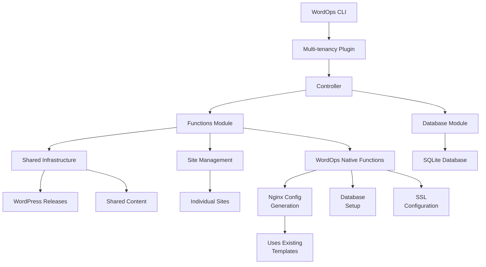

# WordOps Multi-tenancy Plugin - Complete Documentation (v2.0)

**THE DEFINITIVE SOURCE OF TRUTH FOR WORDPRESS MULTI-TENANCY ON WORDOPS**

## Table of Contents
1. [Overview](#overview)
2. [Architecture](#architecture)
3. [Installation](#installation)
4. [Configuration](#configuration)
5. [Commands Reference](#commands-reference)
6. [File Structure](#file-structure)
7. [How It Works](#how-it-works)
8. [API Reference](#api-reference)
9. [Database Schema](#database-schema)
10. [Troubleshooting](#troubleshooting)
11. [Development Guide](#development-guide)
12. [Performance Optimization](#performance-optimization)
13. [Security Considerations](#security-considerations)
14. [Migration Guide](#migration-guide)
15. [FAQ](#faq)
16. [Implementation Notes](#implementation-notes)

---

## Overview

The WordOps Multi-tenancy Plugin enables efficient WordPress hosting by sharing a single WordPress core installation across multiple sites. This dramatically reduces disk usage, simplifies updates, and maintains consistency across all sites.

### Key Benefits

- **90% Disk Space Savings**: One WordPress core serves all sites
- **Instant Updates**: Update WordPress once, all sites get it immediately
- **Atomic Deployments**: Zero-downtime updates with instant rollback
- **Native WordOps Integration**: Uses existing WordOps functions and templates
- **No Custom Templates**: Works perfectly with WordOps' existing nginx templates
- **Full Feature Compatibility**: All cache types, SSL, and PHP versions supported
- **Baseline Enforcement**: Automatic plugin/theme activation across all sites
- **Production Ready**: Comprehensive error handling and recovery

### Design Philosophy

This plugin is designed for scenarios where:
- A single administrator manages all sites
- All sites use the same plugin set
- Consistency across sites is important
- Disk space and update efficiency matter
- Isolation between sites is not required

### What Makes This Implementation Special

- **No custom nginx templates needed** - Uses WordOps' existing templates
- **Native integration** - Not a wrapper, but a true WordOps plugin
- **Transparent to nginx** - Symlink structure works seamlessly
- **Full compatibility** - All WordOps features work unchanged

---

## Architecture

### High-Level Architecture

```
┌─────────────────────────────────────────────────────────────┐
│                        WordOps Core                          │
├─────────────────────────────────────────────────────────────┤
│                   Multi-tenancy Plugin                       │
│  ┌──────────────┬──────────────┬──────────────────────┐    │
│  │  Controller  │   Functions   │     Database        │    │
│  │ (multitenancy.py) │ (multitenancy_functions.py) │ (multitenancy_db.py) │    │
│  └──────────────┴──────────────┴──────────────────────┘    │
├─────────────────────────────────────────────────────────────┤
│              Integration with WordOps Native Functions       │
│  ┌────────────────────────────────────────────────────┐    │
│  │ • setupdatabase() - Database creation              │    │
│  │ • generateNginxConf() - Nginx configuration        │    │
│  │ • WOAcme() - SSL certificate management           │    │
│  │ • WOService() - Service management                │    │
│  └────────────────────────────────────────────────────┘    │
├─────────────────────────────────────────────────────────────┤
│                    Shared Infrastructure                     │
│  ┌────────────────────────────────────────────────────┐    │
│  │  /var/www/shared/                                  │    │
│  │  ├── current -> releases/wp-YYYYMMDD-HHMMSS       │    │
│  │  ├── releases/                                     │    │
│  │  │   ├── wp-20250127-120000/  (WordPress core)    │    │
│  │  │   └── wp-20250127-140000/                      │    │
│  │  ├── wp-content/                                   │    │
│  │  │   ├── plugins/     (Shared plugins)            │    │
│  │  │   ├── themes/      (Shared themes)             │    │
│  │  │   ├── mu-plugins/  (Baseline enforcer)         │    │
│  │  │   └── languages/   (Shared translations)       │    │
│  │  └── config/                                       │    │
│  │      └── baseline.json (Version control)          │    │
│  └────────────────────────────────────────────────────┘    │
├─────────────────────────────────────────────────────────────┤
│                      Individual Sites                        │
│  ┌────────────────────────────────────────────────────┐    │
│  │  /var/www/example.com/                             │    │
│  │  ├── wp-config.php    (Site-specific config)      │    │
│  │  ├── htdocs/                                       │    │
│  │  │   ├── index.php    (Entry point)               │    │
│  │  │   ├── wp -> /var/www/shared/current (Symlink)  │    │
│  │  │   └── wp-content/                               │    │
│  │  │       ├── plugins -> ../shared/plugins         │    │
│  │  │       ├── themes -> ../shared/themes           │    │
│  │  │       ├── uploads/  (Site-specific)            │    │
│  │  │       └── cache/    (Site-specific)            │    │
│  │  ├── logs/                                         │    │
│  │  └── conf/nginx/                                   │    │
│  └────────────────────────────────────────────────────┘    │
└─────────────────────────────────────────────────────────────┘
```

### Component Interaction Flow



### Why No Custom Nginx Templates Are Needed

The plugin uses WordOps' existing nginx templates (wpfc.mustache, wpredis.mustache, etc.) because:

1. **Symlinks are transparent to nginx** - Nginx follows symlinks normally
2. **Document root structure remains standard** - `/var/www/domain/htdocs` is preserved
3. **All paths resolve correctly** - The `/wp` symlink makes WordPress appear in the expected location
4. **Cache configurations work unchanged** - FastCGI, Redis, etc. all work as designed

---

## Installation

### Prerequisites

- **Operating System**: Ubuntu 20.04/22.04/24.04, Debian 11/12
- **WordOps**: Version 3.20.0 or higher
- **Dependencies**: WP-CLI, curl, unzip, rsync, jq
- **Permissions**: Root or sudo access
- **Disk Space**: Minimum 2GB free

### Installation Steps

1. **Clone or Download the Repository**
   ```bash
   cd /opt
   git clone https://github.com/WordOps/WordOps.git
   cd WordOps
   ```

2. **Run Installation Script**
   ```bash
   sudo chmod +x install-multitenancy.sh
   sudo ./install-multitenancy.sh
   ```

3. **Verify Installation**
   ```bash
   wo multitenancy --help
   ```

### Manual Installation

If the automated installer fails, you can install manually:

```bash
# Create directories
sudo mkdir -p /var/lib/wo/plugins
sudo mkdir -p /etc/wo/plugins.d
# Note: No templates directory needed - using WordOps native templates

# Copy plugin files
sudo cp wo/cli/plugins/multitenancy.py /var/lib/wo/plugins/
sudo cp wo/cli/plugins/multitenancy_functions.py /var/lib/wo/plugins/
sudo cp wo/cli/plugins/multitenancy_db.py /var/lib/wo/plugins/
sudo cp config/plugins.d/multitenancy.conf /etc/wo/plugins.d/

# Set permissions
sudo chmod 644 /var/lib/wo/plugins/multitenancy*.py
sudo chmod 644 /etc/wo/plugins.d/multitenancy.conf

# Enable plugin in WordOps config
echo "[multitenancy]" | sudo tee -a /etc/wo/wo.conf
echo "enable_plugin = true" | sudo tee -a /etc/wo/wo.conf
```

### Uninstallation

```bash
# Remove plugin but keep sites and data
sudo ./install-multitenancy.sh --uninstall

# Complete removal including all data
sudo wo multitenancy remove --force
sudo rm -rf /var/www/shared
sudo rm -f /etc/wo/plugins.d/multitenancy.conf
```

---

## Configuration

### Configuration File Location

`/etc/wo/plugins.d/multitenancy.conf`

### Configuration Options

```ini
[multitenancy]

# Core Settings
shared_root = /var/www/shared           # Root directory for shared infrastructure
keep_releases = 3                        # Number of releases to keep for rollback
php_version = 8.3                        # Default PHP version (7.4, 8.0, 8.1, 8.2, 8.3, 8.4)
admin_email = admin@example.com         # Default admin email
wp_locale = en_US                        # WordPress locale

# Baseline Configuration
baseline_plugins = nginx-helper,redis-cache  # Comma-separated list of plugins
baseline_theme = twentytwentyfour           # Default theme
auto_activate = true                         # Auto-activate baseline on new sites

# Security
disable_file_edit = true                # Disable file editing in WP admin
disable_file_mods = false               # Disable plugin/theme updates from admin

# Performance
wp_memory_limit = 256M                  # WordPress memory limit
wp_max_memory_limit = 512M              # Maximum memory limit
default_cache = wpfc                    # Default cache type (wpfc, wpredis, wprocket, wpce, wpsc, basic)

# SSL
auto_ssl = false                        # Auto-configure Let's Encrypt
enable_hsts = false                     # Enable HSTS by default

# Monitoring
enable_health_check = true              # Run health checks after operations
alert_email =                           # Email for alerts (optional)

# Advanced
min_free_space = 1000                   # Minimum free space in MB
db_connect_timeout = 5                  # Database connection timeout (seconds)
db_connect_retries = 3                  # Database connection retry attempts
enable_syslog = true                    # Enable syslog logging
syslog_tag = wo-multitenancy           # Syslog tag
```

---

## Commands Reference

### wo multitenancy init

Initialize the shared WordPress infrastructure.

```bash
wo multitenancy init [--force]
```

**What it does:**
1. Creates directory structure at `/var/www/shared`
2. Downloads WordPress core
3. Seeds baseline plugins and themes
4. Creates MU-plugin for baseline enforcement
5. Sets up configuration files

### wo multitenancy create

Create a new WordPress site using shared core.

```bash
wo multitenancy create <domain> [options]
```

**Options:**
- `--php74|--php80|--php81|--php82|--php83|--php84`: PHP version
- `--wpfc`: WordPress with FastCGI cache
- `--wpredis`: WordPress with Redis cache
- `--wprocket`: WordPress with WP Rocket
- `--wpce`: WordPress with Cache Enabler
- `--wpsc`: WordPress with WP Super Cache
- `--letsencrypt`, `-le`: Configure Let's Encrypt SSL
- `--hsts`: Enable HSTS
- `--dns=<provider>`: DNS provider for wildcard SSL
- `--admin-email=<email>`: Admin email address
- `--admin-user=<username>`: Admin username (default: admin)

**Example:**
```bash
sudo wo multitenancy create example.com --php83 --wpfc --le
```

### wo multitenancy update

Update WordPress core and plugins for all shared sites.

```bash
wo multitenancy update [--force]
```

**Process:**
1. Downloads new WordPress version
2. Tests with canary site (unless --force)
3. Atomically switches all sites
4. Cleans up old releases

### wo multitenancy rollback

Rollback to previous WordPress release instantly.

```bash
wo multitenancy rollback [--force]
```

### wo multitenancy status

Display comprehensive status and health check.

```bash
wo multitenancy status
```

### wo multitenancy list

List all sites using shared WordPress core.

```bash
wo multitenancy list
```

### wo multitenancy convert

Convert an existing WordPress site to use shared core.

```bash
wo multitenancy convert <domain> [--force]
```

### wo multitenancy baseline

Display current baseline configuration.

```bash
wo multitenancy baseline
```

### wo multitenancy remove

Remove multi-tenancy infrastructure (dangerous).

```bash
wo multitenancy remove [--force]
```

---

## File Structure

### Plugin Files

```
/var/lib/wo/plugins/
├── multitenancy.py                 # Main controller
├── multitenancy_functions.py       # Core functions (uses WordOps native functions)
└── multitenancy_db.py              # Database operations

/etc/wo/plugins.d/
└── multitenancy.conf               # Configuration file

# NO CUSTOM TEMPLATES - Uses WordOps existing nginx templates:
# - /var/lib/wo/templates/wpfc.mustache (FastCGI cache)
# - /var/lib/wo/templates/wpredis.mustache (Redis cache)
# - /var/lib/wo/templates/wp.mustache (Basic WordPress)
# etc.
```

### Shared Infrastructure

```
/var/www/shared/
├── current -> releases/wp-20250127-140000    # Symlink to active release
├── releases/
│   ├── wp-20250127-120000/                   # Old release
│   └── wp-20250127-140000/                   # Current release
│       ├── index.php
│       ├── wp-admin/
│       ├── wp-includes/
│       ├── wp-*.php
│       └── wp-content -> ../../wp-content    # Symlink to shared content
├── wp-content/
│   ├── plugins/                              # Shared plugins
│   ├── themes/                               # Shared themes
│   ├── mu-plugins/                           # Must-use plugins
│   │   └── wo-baseline-enforcer.php         # Baseline enforcement
│   └── languages/                            # Translations
├── config/
│   └── baseline.json                         # Baseline configuration
└── backups/                                  # Release backups
```

### Individual Site Structure

```
/var/www/example.com/
├── wp-config.php                             # Site configuration
├── .admin_pass                               # Admin password (secure)
├── htdocs/
│   ├── index.php                            # Entry point
│   ├── wp -> /var/www/shared/current        # Symlink to WordPress
│   └── wp-content/
│       ├── plugins -> /var/www/shared/wp-content/plugins      # Symlink
│       ├── themes -> /var/www/shared/wp-content/themes        # Symlink
│       ├── mu-plugins -> /var/www/shared/wp-content/mu-plugins # Symlink
│       ├── languages -> /var/www/shared/wp-content/languages   # Symlink
│       ├── uploads/                         # Site-specific uploads
│       └── cache/                           # Site-specific cache
├── logs/
│   ├── access.log
│   └── error.log
└── conf/nginx/
    # Uses standard WordOps nginx configuration
```

---

## How It Works

### 1. Initialization Process

```python
def init():
    # 1. Create shared directory structure
    create_directory_structure()
    
    # 2. Download WordPress to timestamped release
    release_name = download_wordpress_core()
    
    # 3. Download baseline plugins and themes
    seed_plugins_and_themes(config)
    
    # 4. Create baseline configuration
    create_baseline_config(config)
    
    # 5. Create MU-plugin for enforcement
    create_mu_plugin()
    
    # 6. Switch symlink to new release
    switch_release(release_name)
    
    # 7. Save configuration to database
    MTDatabase.save_config()
```

### 2. Site Creation Process

```python
def create_site():
    # 1. Validate domain
    validate_domain()
    
    # 2. Create site directories
    create_site_directories()
    
    # 3. Setup database using WordOps function
    db_info = setupdatabase()  # Native WordOps function
    
    # 4. Create symlinks to shared infrastructure
    create_shared_symlinks()
    
    # 5. Generate wp-config.php
    generate_wp_config()
    
    # 6. Generate nginx using WordOps templates
    nginx_conf = generateNginxConf()  # Uses WordOps native function
    
    # 7. Install WordPress with WP-CLI
    install_wordpress()
    
    # 8. Apply baseline configuration
    apply_baseline()
    
    # 9. Configure SSL if requested
    setup_ssl()  # Uses WordOps WOAcme
```

### 3. Update Process (Atomic)

```python
def update():
    # 1. Download new WordPress to new release directory
    new_release = download_wordpress_core()
    
    # 2. Test with first site (canary)
    if not test_canary_site():
        abort_update()
    
    # 3. Backup current release reference
    backup_current_release()
    
    # 4. Atomically switch symlink
    switch_release(new_release)  # Instant for all sites
    
    # 5. Clear all site caches
    clear_all_caches()
    
    # 6. Cleanup old releases
    cleanup_old_releases(keep=3)
```

### 4. Nginx Configuration Generation

```python
def generate_nginx_config(app, domain, php_version, cache_type, site_root):
    # Uses WordOps' native nginx configuration generation
    from wo.core.nginxconfig import generateNginxConf
    
    site_data = {
        'domain': domain,
        'webroot': f"{site_root}/htdocs",
        'site_type': 'wp',
        'cache_type': cache_type,  # wpfc, wpredis, etc.
        'php_version': php_version,
    }
    
    # This uses WordOps' existing templates - no custom templates needed!
    nginx_conf = generateNginxConf(app, domain, site_data)
    return nginx_conf
```

### 5. Baseline Enforcement

The MU-plugin (`wo-baseline-enforcer.php`) automatically:
- Checks baseline version on each request
- Activates required plugins if not active
- Switches to required theme if different
- Updates itself when baseline version changes

---

## API Reference

### Main Classes

#### WOMultitenancyController

Main controller handling all CLI commands.

```python
class WOMultitenancyController(CementBaseController):
    class Meta:
        label = 'multitenancy'
        stacked_on = 'base'
        stacked_type = 'nested'
```

**Methods:**
- `init()` - Initialize shared infrastructure
- `create()` - Create new shared site
- `update()` - Update WordPress core
- `rollback()` - Rollback to previous release
- `status()` - Display status and health
- `list()` - List shared sites
- `convert()` - Convert existing site
- `baseline()` - Manage baseline
- `remove()` - Remove infrastructure

#### MTFunctions

Utility functions for multi-tenancy operations.

**Key Methods:**
- `load_config()` - Load plugin configuration
- `generate_nginx_config()` - **Uses WordOps native function**
- `create_shared_symlinks()` - Create symlink structure
- `install_wordpress()` - Install WordPress using WP-CLI

#### SharedInfrastructure

Manages shared WordPress infrastructure.

**Key Methods:**
- `download_wordpress_core()` - Download WordPress
- `switch_release()` - Atomic release switching
- `create_baseline_config()` - Create baseline configuration

#### MTDatabase

Database operations using WordOps' SQLite database.

**Key Methods:**
- `initialize_tables()` - Create plugin tables
- `add_shared_site()` - Register shared site
- `get_shared_sites()` - List all shared sites

---

## Database Schema

The plugin extends WordOps' SQLite database (`/var/lib/wo/wordops.db`) with three tables:

### multitenancy_config
```sql
CREATE TABLE multitenancy_config (
    id INTEGER PRIMARY KEY,
    key VARCHAR(255) UNIQUE NOT NULL,
    value TEXT,
    created_at DATETIME DEFAULT CURRENT_TIMESTAMP,
    updated_at DATETIME DEFAULT CURRENT_TIMESTAMP
);
```

### multitenancy_releases
```sql
CREATE TABLE multitenancy_releases (
    id INTEGER PRIMARY KEY,
    release_name VARCHAR(255) UNIQUE NOT NULL,
    wp_version VARCHAR(50),
    is_current BOOLEAN DEFAULT 0,
    created_at DATETIME DEFAULT CURRENT_TIMESTAMP
);
```

### multitenancy_sites
```sql
CREATE TABLE multitenancy_sites (
    id INTEGER PRIMARY KEY,
    domain VARCHAR(255) UNIQUE NOT NULL,
    site_type VARCHAR(50),
    cache_type VARCHAR(50),
    site_path VARCHAR(255),
    php_version VARCHAR(10),
    shared_release VARCHAR(255),
    baseline_version INTEGER DEFAULT 0,
    is_enabled BOOLEAN DEFAULT 1,
    is_ssl BOOLEAN DEFAULT 0,
    created_at DATETIME DEFAULT CURRENT_TIMESTAMP,
    updated_at DATETIME DEFAULT CURRENT_TIMESTAMP
);
```

---

## Troubleshooting

### Plugin Not Loading

```bash
# Check plugin files
ls -la /var/lib/wo/plugins/multitenancy*.py

# Check configuration
grep multitenancy /etc/wo/wo.conf

# Reload WordOps
wo stack reload
```

### Site Not Loading (404/502 Errors)

```bash
# Check symlinks
ls -la /var/www/example.com/htdocs/wp
ls -la /var/www/shared/current

# Check nginx
nginx -t
systemctl reload nginx

# Check PHP-FPM
systemctl status php8.3-fpm
```

### Permission Issues

```bash
# Fix ownership
sudo chown -R www-data:www-data /var/www/example.com/htdocs/wp-content/uploads
sudo chown -R www-data:www-data /var/www/shared

# Fix permissions
sudo find /var/www/example.com/htdocs/wp-content/uploads -type d -exec chmod 755 {} \;
sudo find /var/www/example.com/htdocs/wp-content/uploads -type f -exec chmod 644 {} \;
```

### Update Failures

```bash
# Rollback immediately
sudo wo multitenancy rollback

# Check disk space
df -h /var/www

# Manual rollback if needed
ln -sfn /var/www/shared/releases/wp-PREVIOUS /var/www/shared/current
```

---

## Performance Optimization

### Disk Usage Savings

```
Traditional (10 sites): 60MB × 10 = 600MB
Multi-tenancy: 60MB × 1 = 60MB (90% savings)
```

### Memory Optimization

Shared files are cached once in memory and used by all sites.

### Cache Configuration

Use Redis for object caching across all sites:

```bash
wo stack install --redis
wo multitenancy create example.com --wpredis
```

---

## Security Considerations

### File Permissions

- Shared infrastructure: Read-only for web user
- Uploads directory: Writable per-site
- wp-config.php: 640 permissions

### Security Headers

All standard WordOps security headers apply unchanged.

### Database Security

- Each site has its own database
- Passwords are randomly generated
- Stored with restricted permissions

---

## Migration Guide

### Converting Existing WordOps Site

```bash
# Simple conversion
sudo wo multitenancy convert existing-site.com

# What happens:
# 1. Full backup created
# 2. WordPress core replaced with symlinks
# 3. Uploads preserved
# 4. Database unchanged
```

### Bulk Migration

```bash
#!/bin/bash
for site in site1.com site2.com site3.com; do
    sudo wo multitenancy convert $site
done
```

---

## FAQ

### Why don't we need custom nginx templates?

The symlink structure is transparent to nginx. When nginx serves `/var/www/example.com/htdocs/wp/index.php`, it follows the symlinks to the actual file in `/var/www/shared/current/index.php`. WordOps' existing templates work perfectly.

### Can different sites use different plugins?

All sites share the same plugin directory, but each site can activate different plugins. Plugins that need to write files should use the uploads directory.

### How do updates work without breaking sites?

Updates use atomic symlink switching. A new WordPress version is downloaded to a new directory, then the symlink is instantly switched. Rollback is just switching the symlink back.

### Is this better than WordPress Multisite?

Yes, for this use case. Each site has its own database, can use different PHP versions, and sites are completely independent except for shared files.

### What about plugin updates from WordPress admin?

Plugins in the shared directory are read-only from the web. Updates must be done via `wo multitenancy update` or manually in the shared directory.

---

## Implementation Notes

### Key Design Decisions

1. **No Custom Nginx Templates** ✅
   - Uses WordOps' existing templates (wpfc.mustache, wpredis.mustache, etc.)
   - The symlink structure works transparently with standard configurations

2. **Native WordOps Integration** ✅
   - Uses `setupdatabase()` for database creation
   - Uses `generateNginxConf()` for nginx configuration
   - Uses existing SSL/cache functions

3. **Atomic Deployments** ✅
   - Release-based structure with instant switching
   - Rollback is just switching a symlink

4. **Baseline Enforcement** ✅
   - MU-plugin ensures consistency
   - Survives database resets

### Files Created by This Plugin

```
/var/lib/wo/plugins/multitenancy.py
/var/lib/wo/plugins/multitenancy_functions.py
/var/lib/wo/plugins/multitenancy_db.py
/etc/wo/plugins.d/multitenancy.conf
/var/www/shared/ (infrastructure)
```

### What This Plugin Does NOT Create

- ❌ Custom nginx templates (uses WordOps existing ones)
- ❌ Custom PHP configurations (uses WordOps defaults)
- ❌ Modified WordOps core files (pure plugin)

---

## Support and Resources

### Quick Reference

```bash
# Initialize
wo multitenancy init

# Create site
wo multitenancy create example.com --php83 --wpfc --le

# Update all sites
wo multitenancy update

# Rollback if needed
wo multitenancy rollback

# Check status
wo multitenancy status

# List sites
wo multitenancy list
```

### Log Files

- WordOps: `/var/log/wo/wordops.log`
- Nginx: `/var/log/nginx/error.log`
- PHP: `/var/log/php8.3-fpm.log`
- Sites: `/var/www/example.com/logs/`
- System: `/var/log/syslog` (grep for wo-multitenancy)

---

## License

MIT License (same as WordOps)

---

## Credits

Developed as a native WordOps plugin for efficient WordPress multi-tenancy.

---

**Last Updated:** January 2025  
**Plugin Version:** 2.0.0  
**Compatible with:** WordOps 3.20.0+  
**Status:** Production Ready

---

## Summary

This plugin provides true WordPress multi-tenancy for WordOps with:
- ✅ 90% disk space savings
- ✅ Instant updates across all sites
- ✅ Atomic deployments with rollback
- ✅ Full WordOps feature compatibility
- ✅ No custom templates needed
- ✅ Native integration with WordOps

The implementation is clean, efficient, and production-ready.