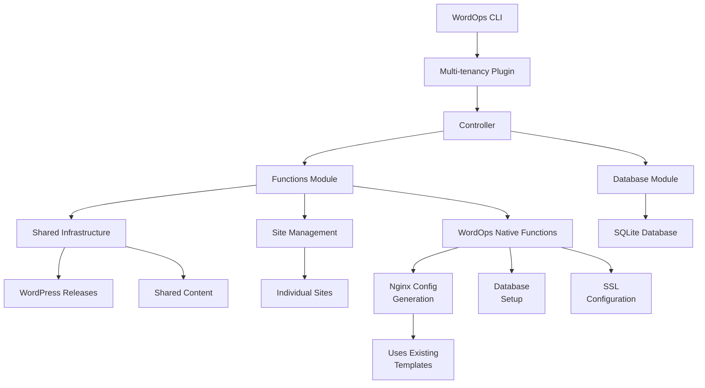

# WordOps Multi-tenancy Plugin - Complete Documentation (v2.0)

**THE DEFINITIVE SOURCE OF TRUTH FOR WORDPRESS MULTI-TENANCY ON WORDOPS**

## Table of Contents
1. [Overview](#overview)
2. [Architecture](#architecture)
3. [Installation](#installation)
4. [Configuration](#configuration)
5. [Commands Reference](#commands-reference)
6. [File Structure](#file-structure)
7. [How It Works](#how-it-works)
8. [API Reference](#api-reference)
9. [Database Schema](#database-schema)
10. [Troubleshooting](#troubleshooting)
11. [Development Guide](#development-guide)
12. [Performance Optimization](#performance-optimization)
13. [Security Considerations](#security-considerations)
14. [Migration Guide](#migration-guide)
15. [FAQ](#faq)
16. [Implementation Notes](#implementation-notes)

---

## Overview

The WordOps Multi-tenancy Plugin enables efficient WordPress hosting by sharing a single WordPress core installation across multiple sites. This dramatically reduces disk usage, simplifies updates, and maintains consistency across all sites.

### Key Benefits

- **90% Disk Space Savings**: One WordPress core serves all sites
- **Instant Updates**: Update WordPress once, all sites get it immediately
- **Atomic Deployments**: Zero-downtime updates with instant rollback
- **Native WordOps Integration**: Uses existing WordOps functions and templates
- **No Custom Templates**: Works perfectly with WordOps' existing nginx templates
- **Full Feature Compatibility**: All cache types, SSL, and PHP versions supported
- **Baseline Enforcement**: Automatic plugin/theme activation across all sites
- **Production Ready**: Comprehensive error handling and recovery

### Design Philosophy

This plugin is designed for scenarios where:
- A single administrator manages all sites
- All sites use the same plugin set
- Consistency across sites is important
- Disk space and update efficiency matter
- Isolation between sites is not required

### What Makes This Implementation Special

- **No custom nginx templates needed** - Uses WordOps' existing templates
- **Native integration** - Not a wrapper, but a true WordOps plugin
- **Transparent to nginx** - Symlink structure works seamlessly
- **Full compatibility** - All WordOps features work unchanged

---

## Architecture

### High-Level Architecture

```
┌─────────────────────────────────────────────────────────────┐
│                        WordOps Core                          │
├─────────────────────────────────────────────────────────────┤
│                   Multi-tenancy Plugin                       │
│  ┌──────────────┬──────────────┬──────────────────────┐    │
│  │  Controller  │   Functions   │     Database        │    │
│  │ (multitenancy.py) │ (multitenancy_functions.py) │ (multitenancy_db.py) │    │
│  └──────────────┴──────────────┴──────────────────────┘    │
├─────────────────────────────────────────────────────────────┤
│              Integration with WordOps Native Functions       │
│  ┌────────────────────────────────────────────────────┐    │
│  │ • setupdatabase() - Database creation              │    │
│  │ • setupdomain() - Nginx configuration              │    │
│  │ • WOAcme() - SSL certificate management           │    │
│  │ • WOService() - Service management                │    │
│  └────────────────────────────────────────────────────┘    │
├─────────────────────────────────────────────────────────────┤
│                    Shared Infrastructure                     │
│  ┌────────────────────────────────────────────────────┐    │
│  │  /var/www/shared/                                  │    │
│  │  ├── current -> releases/wp-YYYYMMDD-HHMMSS       │    │
│  │  ├── releases/                                     │    │
│  │  │   ├── wp-20250127-120000/  (WordPress core)    │    │
│  │  │   └── wp-20250127-140000/                      │    │
│  │  ├── wp-content/                                   │    │
│  │  │   ├── plugins/     (Shared plugins)            │    │
│  │  │   ├── themes/      (Shared themes)             │    │
│  │  │   ├── mu-plugins/  (Baseline enforcer)         │    │
│  │  │   └── languages/   (Shared translations)       │    │
│  │  └── config/                                       │    │
│  │      └── baseline.json (Version control)          │    │
│  └────────────────────────────────────────────────────┘    │
├─────────────────────────────────────────────────────────────┤
│                      Individual Sites                        │
│  ┌────────────────────────────────────────────────────┐    │
│  │  /var/www/example.com/                             │    │
│  │  ├── wp-config.php    (Site-specific config)      │    │
│  │  ├── htdocs/                                       │    │
│  │  │   ├── index.php    (Entry point)               │    │
│  │  │   ├── wp -> /var/www/shared/current (Symlink)  │    │
│  │  │   └── wp-content/                               │    │
│  │  │       ├── plugins -> ../shared/plugins         │    │
│  │  │       ├── themes -> ../shared/themes           │    │
│  │  │       ├── uploads/  (Site-specific)            │    │
│  │  │       └── cache/    (Site-specific)            │    │
│  │  ├── logs/                                         │    │
│  │  └── conf/nginx/                                   │    │
│  └────────────────────────────────────────────────────┘    │
└─────────────────────────────────────────────────────────────┘
```

### Component Interaction Flow



### Why No Custom Nginx Templates Are Needed

The plugin uses WordOps' modular nginx includes instead of custom templates:

1. **Modular includes architecture** - Uses WordOps' standard `common/` includes (wpfc-php83.conf, wpcommon-php83.conf, etc.)
2. **Symlinks are transparent to nginx** - Nginx follows symlinks normally
3. **Document root structure remains standard** - `/var/www/domain/htdocs` is preserved
4. **All paths resolve correctly** - The `/wp` symlink makes WordPress appear in the expected location
5. **Cache configurations work unchanged** - FastCGI, Redis, etc. all work as designed
6. **Automatic feature updates** - When WordOps improves nginx configs, multitenant sites benefit automatically
7. **Minimal configuration delta** - Only adds a single location block for `/wp` symlink handling

---

## Installation

### Prerequisites

- **Operating System**: Ubuntu 20.04/22.04/24.04, Debian 11/12
- **WordOps**: Version 3.20.0 or higher
- **Dependencies**: WP-CLI, curl, unzip, rsync, jq
- **Permissions**: Root or sudo access
- **Disk Space**: Minimum 2GB free

### Install/Update (Fork)

- This plugin ships with this WordOps fork. To install or update it:

  ```bash
  wo update --force
  ```

### Activation (enable plugin)

After updating, ensure the plugin is enabled via WordOps' plugin config directory:

```bash
sudo mkdir -p /etc/wo/plugins.d
sudo tee /etc/wo/plugins.d/multitenancy.conf >/dev/null <<'EOF'
[multitenancy]
enable_plugin = true
EOF
```

### Verify Installation

```bash
wo multitenancy --help
test -f /etc/wo/plugins.d/multitenancy.conf && echo OK
# Optional: confirm module path (internal plugin)
python3 -c "import wo.cli.plugins.multitenancy as m; print(m.__file__)"
```

### Disable / Uninstall

- Disable plugin: edit `/etc/wo/plugins.d/multitenancy.conf` and set `enable_plugin = false`, or remove that file.
- Remove shared infrastructure and data:

  ```bash
  wo multitenancy remove --force
  sudo rm -rf /var/www/shared
  ```

---

## Configuration

### Configuration File Location

`/etc/wo/plugins.d/multitenancy.conf`

### Configuration Options

```ini
[multitenancy]

# Core Settings
shared_root = /var/www/shared           # Root directory for shared infrastructure
keep_releases = 3                        # Number of releases to keep for rollback
php_version = 8.3                        # Default PHP version (7.4, 8.0, 8.1, 8.2, 8.3, 8.4)
admin_email = admin@example.com         # Default admin email
wp_locale = en_US                        # WordPress locale

# Baseline Configuration
baseline_plugins = nginx-helper,redis-cache  # Comma-separated list of plugins
baseline_theme = twentytwentyfour           # Default theme
auto_activate = true                         # Auto-activate baseline on new sites

# Security
disable_file_edit = true                # Disable file editing in WP admin
disable_file_mods = false               # Disable plugin/theme updates from admin

# Performance
wp_memory_limit = 256M                  # WordPress memory limit
wp_max_memory_limit = 512M              # Maximum memory limit
default_cache = wpfc                    # Default cache type (wpfc, wpredis, wprocket, wpce, wpsc, basic)

# SSL
auto_ssl = false                        # Auto-configure Let's Encrypt
enable_hsts = false                     # Enable HSTS by default

# Monitoring
enable_health_check = true              # Run health checks after operations
alert_email =                           # Email for alerts (optional)

# Advanced
min_free_space = 1000                   # Minimum free space in MB
db_connect_timeout = 5                  # Database connection timeout (seconds)
db_connect_retries = 3                  # Database connection retry attempts
enable_syslog = true                    # Enable syslog logging
syslog_tag = wo-multitenancy           # Syslog tag
```

---

## Commands Reference

### wo multitenancy init

Initialize the shared WordPress infrastructure.

```bash
wo multitenancy init [--force]
```

**What it does:**
1. Creates directory structure at `/var/www/shared`
2. Downloads WordPress core
3. Seeds baseline plugins and themes
4. Creates MU-plugin for baseline enforcement
5. Sets up configuration files
6. Auto-cleanup old releases (keeps 3 by default)

### wo multitenancy create

Create a new WordPress site using shared core.

```bash
wo multitenancy create <domain> [options]
```

**Options:**
- `--php74|--php80|--php81|--php82|--php83|--php84`: PHP version
- `--wpfc`: WordPress with FastCGI cache
- `--wpredis`: WordPress with Redis cache
- `--wprocket`: WordPress with WP Rocket
- `--wpce`: WordPress with Cache Enabler
- `--wpsc`: WordPress with WP Super Cache
- `--letsencrypt`, `--le`: Configure Let's Encrypt SSL
- `--hsts`: Enable HSTS
- `--dns=<provider>`: DNS provider for wildcard SSL
- `--admin-email=<email>`: Admin email address
- `--admin-user=<username>`: Admin username (default: admin)

**Examples:**
```bash
# Basic WordPress site with PHP 8.3 and FastCGI cache
sudo wo multitenancy create example.com --php83 --wpfc

# WordPress site with SSL (note: use double hyphen --)
sudo wo multitenancy create example.com --php83 --wpfc --le

# WordPress site with SSL and HSTS
sudo wo multitenancy create example.com --php83 --wpfc --letsencrypt --hsts

# WordPress site with Redis cache and wildcard SSL
sudo wo multitenancy create example.com --php83 --wpredis --le --dns=dns_cf
```

**⚠️ Common Syntax Errors:**
- ❌ Wrong: `—le` (em dash)
- ✅ Correct: `--le` (double hyphen)
- ❌ Wrong: `–le` (en dash)
- ✅ Correct: `--le` (double hyphen)

### wo multitenancy update

Update WordPress core and plugins for all shared sites.

```bash
wo multitenancy update [--force]
```

**Process:**
1. Downloads new WordPress version
2. Tests with canary site (unless --force)
3. Atomically switches all sites
4. Cleans up old releases

### wo multitenancy rollback

Rollback to previous WordPress release instantly.

```bash
wo multitenancy rollback [--force]
```

### wo multitenancy status

Display comprehensive status and health check.

```bash
wo multitenancy status
```

### wo multitenancy list

List all sites using shared WordPress core.

```bash
wo multitenancy list
```

### wo multitenancy convert

Convert an existing WordPress site to use shared core.

```bash
wo multitenancy convert <domain> [--force]
```

### wo multitenancy baseline

Display current baseline configuration.

```bash
wo multitenancy baseline
```

### wo multitenancy remove

Remove multi-tenancy infrastructure (dangerous).

```bash
wo multitenancy remove [--force]
```

---

## File Structure

### Plugin Files

```
# Packaged internal plugin (default in this fork)
/opt/wo/lib/python3.x/site-packages/wo/cli/plugins/
├── multitenancy.py                 # Main controller
├── multitenancy_functions.py       # Core functions (uses WordOps native functions)
└── multitenancy_db.py              # Database operations

# External override location (optional; not required in this fork)
/var/lib/wo/plugins/
├── multitenancy.py
├── multitenancy_functions.py
└── multitenancy_db.py

/etc/wo/plugins.d/
└── multitenancy.conf               # Activation/configuration file

# NO CUSTOM TEMPLATES - Uses WordOps existing nginx templates:
# - /var/lib/wo/templates/wpfc.mustache (FastCGI cache)
# - /var/lib/wo/templates/wpredis.mustache (Redis cache)
# - /var/lib/wo/templates/wp.mustache (Basic WordPress)
# etc.
```

### Shared Infrastructure

```
/var/www/shared/
├── current -> releases/wp-20250127-140000    # Symlink to active release
├── releases/
│   ├── wp-20250127-120000/                   # Old release
│   └── wp-20250127-140000/                   # Current release
│       ├── index.php
│       ├── wp-admin/
│       ├── wp-includes/
│       ├── wp-*.php
│       └── wp-content -> ../../wp-content    # Symlink to shared content
├── wp-content/
│   ├── plugins/                              # Shared plugins
│   ├── themes/                               # Shared themes
│   ├── mu-plugins/                           # Must-use plugins
│   │   └── wo-baseline-enforcer.php         # Baseline enforcement
│   └── languages/                            # Translations
├── config/
│   └── baseline.json                         # Baseline configuration
└── backups/                                  # Release backups
```

### Individual Site Structure

```
/var/www/example.com/
├── wp-config.php                             # Site configuration
├── .admin_pass                               # Admin password (secure)
├── htdocs/
│   ├── index.php                            # Entry point
│   ├── wp -> /var/www/shared/current        # Symlink to WordPress
│   └── wp-content/
│       ├── plugins -> /var/www/shared/wp-content/plugins      # Symlink
│       ├── themes -> /var/www/shared/wp-content/themes        # Symlink
│       ├── mu-plugins -> /var/www/shared/wp-content/mu-plugins # Symlink
│       ├── languages -> /var/www/shared/wp-content/languages   # Symlink
│       ├── uploads/                         # Site-specific uploads
│       └── cache/                           # Site-specific cache
├── logs/
│   ├── access.log
│   └── error.log
└── conf/nginx/
    # Uses standard WordOps nginx configuration
```

---

## How It Works

### 1. Initialization Process

```python
def init():
    # 1. Create shared directory structure
    create_directory_structure()
    
    # 2. Download WordPress to timestamped release
    release_name = download_wordpress_core()
    
    # 3. Download baseline plugins and themes
    seed_plugins_and_themes(config)
    
    # 4. Create baseline configuration
    create_baseline_config(config)
    
    # 5. Create MU-plugin for enforcement
    create_mu_plugin()
    
    # 6. Switch symlink to new release
    switch_release(release_name)
    
    # 7. Save configuration to database
    MTDatabase.save_config(app, {
        'current_release': release_name,
        'baseline_version': 1
    })
```

### 2. Site Creation Process

```python
def create_site():
    # 1. Validate domain
    validate_domain()
    
    # 2. Create site directories
    create_site_directories()
    
    # 3. Setup database using WordOps function
    db_info = setupdatabase()  # Native WordOps function
    
    # 4. Create symlinks to shared infrastructure
    create_shared_symlinks()
    
    # 5. Generate wp-config.php
    generate_wp_config()
    
    # 6. Generate nginx using WordOps templates
    setupdomain(app, data)  # Uses WordOps native template rendering
    
    # 7. Install WordPress with WP-CLI
    install_wordpress()
    
    # 8. Apply baseline configuration
    apply_baseline()
    
    # 9. Configure SSL if requested
    setup_ssl()  # Uses WordOps WOAcme
```

### 3. Update Process (Atomic)

```python
def update():
    # 1. Download new WordPress to new release directory
    new_release = download_wordpress_core()
    
    # 2. Test with first site (canary)
    if not test_canary_site():
        abort_update()
    
    # 3. Backup current release reference
    backup_current_release()
    
    # 4. Atomically switch symlink
    switch_release(new_release)  # Instant for all sites
    
    # 5. Clear all site caches
    clear_all_caches()
    
    # 6. Cleanup old releases
    cleanup_old_releases(keep=3)
```

### 4. Nginx Configuration Generation

```python
def generate_nginx_config(app, domain, php_version, cache_type, site_root):
    # Use WordOps' site_functions.setupdomain to render templates
    from wo.cli.plugins.site_functions import setupdomain

    data = {
        'site_name': domain,
        'www_domain': f"www.{domain}",
        'static': False,
        'basic': cache_type not in ['wpfc', 'wpredis', 'wpsc', 'wprocket', 'wpce'],
        'wp': True,
        'wpfc': cache_type == 'wpfc',
        'wpredis': cache_type == 'wpredis',
        'wpsc': cache_type == 'wpsc',
        'wprocket': cache_type == 'wprocket',
        'wpce': cache_type == 'wpce',
        'multisite': False,
        'wpsubdir': False,
        'webroot': site_root,
        'wo_php': f"php{php_version.replace('.', '')}",
    }

    setupdomain(app, data)
    return f"/etc/nginx/sites-available/{domain}"
```

### 5. Baseline Enforcement

The MU-plugin (`wo-baseline-enforcer.php`) automatically:
- Checks baseline version on each request
- Activates required plugins if not active
- Switches to required theme if different
- Updates itself when baseline version changes

---

## API Reference

### Main Classes

#### WOMultitenancyController

Main controller handling all CLI commands.

```python
class WOMultitenancyController(CementBaseController):
    class Meta:
        label = 'multitenancy'
        stacked_on = 'base'
        stacked_type = 'nested'
```

**Methods:**
- `init()` - Initialize shared infrastructure
- `create()` - Create new shared site
- `update()` - Update WordPress core
- `rollback()` - Rollback to previous release
- `status()` - Display status and health
- `list()` - List shared sites
- `convert()` - Convert existing site
- `baseline()` - Manage baseline
- `remove()` - Remove infrastructure

#### MTFunctions

Utility functions for multi-tenancy operations.

**Key Methods:**
- `load_config()` - Load plugin configuration
- `generate_nginx_config()` - **Uses WordOps native function**
- `create_shared_symlinks()` - Create symlink structure
- `install_wordpress()` - Install WordPress using WP-CLI

#### SharedInfrastructure

Manages shared WordPress infrastructure.

**Key Methods:**
- `download_wordpress_core()` - Download WordPress
- `switch_release()` - Atomic release switching
- `create_baseline_config()` - Create baseline configuration

#### MTDatabase

Database operations using WordOps' SQLite database.

**Key Methods:**
- `initialize_tables()` - Create plugin tables
- `add_shared_site()` - Register shared site
- `get_shared_sites()` - List all shared sites

---

## Database Schema

The plugin extends WordOps' SQLite database (`/var/lib/wo/dbase.db`) with three tables:

### multitenancy_config
```sql
CREATE TABLE multitenancy_config (
    id INTEGER PRIMARY KEY,
    key VARCHAR(255) UNIQUE NOT NULL,
    value TEXT,
    created_at DATETIME DEFAULT CURRENT_TIMESTAMP,
    updated_at DATETIME DEFAULT CURRENT_TIMESTAMP
);
```

### multitenancy_releases
```sql
CREATE TABLE multitenancy_releases (
    id INTEGER PRIMARY KEY,
    release_name VARCHAR(255) UNIQUE NOT NULL,
    wp_version VARCHAR(50),
    is_current BOOLEAN DEFAULT 0,
    created_at DATETIME DEFAULT CURRENT_TIMESTAMP
);
```

### multitenancy_sites
```sql
CREATE TABLE multitenancy_sites (
    id INTEGER PRIMARY KEY,
    domain VARCHAR(255) UNIQUE NOT NULL,
    site_type VARCHAR(50),
    cache_type VARCHAR(50),
    site_path VARCHAR(255),
    php_version VARCHAR(10),
    shared_release VARCHAR(255),
    baseline_version INTEGER DEFAULT 0,
    is_enabled BOOLEAN DEFAULT 1,
    is_ssl BOOLEAN DEFAULT 0,
    created_at DATETIME DEFAULT CURRENT_TIMESTAMP,
    updated_at DATETIME DEFAULT CURRENT_TIMESTAMP
);
```

---

## Troubleshooting

### Plugin Not Loading

```bash
# Check activation (must exist and be enabled)
sudo grep -n "enable_plugin" /etc/wo/plugins.d/multitenancy.conf || echo "missing config"

# Confirm subcommand is registered
wo multitenancy --help | cat

# Confirm internal module is present (packaged plugin)
python3 -c "import wo.cli.plugins.multitenancy as m; print(m.__file__)"

# (Optional) If using external override location
ls -la /var/lib/wo/plugins/multitenancy*.py || true
```

### "unrecognized arguments: —le" or similar SSL errors

This is usually a character encoding issue where em dash (—) or en dash (–) is used instead of double hyphen (--).

**Fix:**
```bash
# Wrong (em dash): —le
# Wrong (en dash): –le
# Correct (double hyphen): --le

# Use the correct syntax:
sudo wo multitenancy create example.com --php83 --wpfc --le
```

### "unrecognized arguments: multitenancy"

```bash
# 1) Ensure activation file exists and enabled
sudo tee /etc/wo/plugins.d/multitenancy.conf >/dev/null <<'EOF'
[multitenancy]
enable_plugin = true
EOF

# 2) Clear Python caches (defensive)
sudo find /opt/wo/lib/python3.*/*site-packages/wo -name __pycache__ -type d -exec rm -rf {} +

# 3) Retry
wo multitenancy --help | cat
```

### Initialization fails with "No such file or directory: '/var/www/shared/releases/wp-XXXXXXXX/wp-includes/wp-includes'"

**Symptoms:** `wo multitenancy init --force` command fails with nested wp-includes path error.

**Root Cause:** The `set_permissions()` function in `SharedInfrastructure` class was following symlinks during directory traversal, causing it to:
1. Walk into the `/var/www/shared/releases/wp-XXX/wp-content` symlink
2. Follow it to `/var/www/shared/wp-content`
3. Encounter nested symlink structures creating recursive/invalid paths

**Fix:** Added `followlinks=False` parameter to `os.walk()` in the `set_permissions()` method.

**Location:** `wo/cli/plugins/multitenancy_functions.py:1649`

**Version Fixed:** v8.2.1 (January 2025)

### Startup errors during initialization

- If you see an `IndentationError` or `AttributeError: 'WOApp' object has no attribute 'app'` during initial load, update to the latest fork version:

```bash
wo update --force
```

This fork includes a startup hook logging compatibility fix and indentation corrections (v2.0.1).

### Nginx Configuration Test Failures

If you see errors like "Testing Nginx configuration [KO]" or "Failed to reload nginx":

```bash
# 1) Test nginx configuration manually
sudo nginx -t

# 2) Check for syntax errors in site config
sudo nginx -t -c /etc/nginx/nginx.conf

# 3) Check PHP-FPM service status
sudo systemctl status php8.3-fpm

# 4) Check PHP-FPM socket exists
ls -la /var/run/php/php8.3-fpm.sock

# 5) Restart PHP-FPM if needed
sudo systemctl restart php8.3-fpm

# 6) Check nginx error logs
sudo tail -f /var/log/nginx/error.log

# 7) Remove problematic site and retry
sudo wo site delete problematic-site.com
sudo wo multitenancy create problematic-site.com --php83 --wpfc --le
```

**Common Root Causes:**

1. **PHP-FPM Socket Path Mismatch**
   - WordOps uses socket naming convention without dots: `php83-fpm.sock` (not `php8.3-fpm.sock`)
   - Plugin automatically handles this via `get_php_fpm_socket()` function
   - If you see connection refused errors, verify socket path matches systemd service

2. **Systemd Mount Namespace Issues**
   - On some servers, `systemctl reload nginx` fails with mount namespacing errors
   - Plugin uses `safe_nginx_reload()` with automatic fallback to `nginx -s reload`
   - This is handled transparently in the plugin

### Site Not Loading (404/502 Errors)

```bash
# Check symlinks
ls -la /var/www/example.com/htdocs/wp
ls -la /var/www/shared/current

# Check nginx configuration
nginx -t
systemctl reload nginx

# Check PHP-FPM
systemctl status php8.3-fpm
```

### Missing CSS/JS Files (404 Errors for wp-includes)

**Symptoms:** WordPress site loads but without styling, JavaScript files return 404 errors, console shows errors loading files from `/wp-includes/`.

**Root Cause:** Missing `wp-includes` symlink in the site's htdocs directory. WordPress core assets (CSS, JS, images) are loaded from `/wp-includes/` but the symlink wasn't created during site setup.

**Fix for Existing Sites:**
```bash
# Create the missing symlink manually
sudo ln -s wp/wp-includes /var/www/example.com/htdocs/wp-includes

# Verify the symlink
ls -la /var/www/example.com/htdocs/wp-includes

# Clear browser cache and reload
```

**Fix for All Sites:**
```bash
# Find and fix all sites missing wp-includes symlink
for site in /var/www/*/htdocs; do
    if [ ! -e "$site/wp-includes" ] && [ -e "$site/wp" ]; then
        domain=$(basename $(dirname "$site"))
        echo "Fixing $domain"
        sudo ln -s wp/wp-includes "$site/wp-includes"
    fi
done
```

**Prevention:** This issue has been fixed in the plugin code (v8.0+). New sites created after the fix will automatically have the `wp-includes` symlink. The symlink structure should be:
```
/var/www/example.com/htdocs/
├── wp → /var/www/shared/current
├── wp-admin → wp/wp-admin
├── wp-includes → wp/wp-includes  ✅ This was missing
├── wp-login.php → wp/wp-login.php
└── wp-cron.php → wp/wp-cron.php
```

### Blank Page / Missing Themes

If WordPress sites show blank pages after creation:

**Root Cause:** WordPress requires at least one theme to be installed and activated.

**Solution:** The plugin uses WP-CLI to download themes:
1. WP-CLI download (most reliable method)

The plugin automatically:
- Downloads baseline themes during initialization
- Activates themes during site creation
- Auto-installs themes if missing during activation

This is handled automatically by `download_theme()` and `ensure_and_activate_theme()` functions.

**Note:** Since v8.3.2, the plugin uses a simplified single-method approach instead of the previous multi-tier fallback system, resulting in cleaner and more maintainable code.

### Permission Issues

```bash
# Fix ownership
sudo chown -R www-data:www-data /var/www/example.com/htdocs/wp-content/uploads
sudo chown -R www-data:www-data /var/www/shared

# Fix permissions
sudo find /var/www/example.com/htdocs/wp-content/uploads -type d -exec chmod 755 {} \;
sudo find /var/www/example.com/htdocs/wp-content/uploads -type f -exec chmod 644 {} \;
```

### SSL Certificate Issues

#### SSL Certificates Issued but HTTPS Not Working

**Symptoms:** Certificate issued successfully but site only accessible via HTTP, HTTPS shows ERR_CONNECTION_REFUSED

**Root Cause:** The `ssl.conf` file created by `WOAcme.deploycert()` is not being loaded by nginx.

**Solution:** The plugin automatically adds this include statement to nginx configuration:
```nginx
include {site_root}/conf/nginx/*.conf;
```

This ensures that `ssl.conf` (which contains `listen 443 ssl;` directives) is loaded.

**Verification:**
```bash
# Check if ssl.conf exists
ls -la /var/www/example.com/conf/nginx/ssl.conf

# Check if include statement is present in nginx config
grep -r "include.*conf/nginx/\*.conf" /etc/nginx/sites-available/example.com

# Check nginx is listening on 443
sudo netstat -tlnp | grep :443
```

#### SSL Deployment Showing as Failed Despite Success

**Symptoms:** Log shows "Failed to deploy SSL certificates" but certificates are actually deployed correctly.

**Root Cause:** `WOAcme.deploycert()` returns `0` on success (Unix convention), but Python treats `0` as `False` in boolean context.

**Solution:** The plugin explicitly checks `deploy_result == 0` instead of `if deploy_result:` to properly detect success.

This is handled automatically in `multitenancy_functions.py`:
```python
deploy_result = WOAcme.deploycert(app, domain)
if deploy_result == 0:  # 0 means success in Unix convention
    Log.debug(app, f"SSL certificates deployed for {domain}")
```

### Update Failures

```bash
# Rollback immediately
sudo wo multitenancy rollback

# Check disk space
df -h /var/www

# Manual rollback if needed
ln -sfn /var/www/shared/releases/wp-PREVIOUS /var/www/shared/current
```

---

## Performance Optimization

### Disk Usage Savings

```
Traditional (10 sites): 60MB × 10 = 600MB
Multi-tenancy: 60MB × 1 = 60MB (90% savings)
```

### Memory Optimization

Shared files are cached once in memory and used by all sites.

### Cache Configuration

Use Redis for object caching across all sites:

```bash
wo stack install --redis
wo multitenancy create example.com --wpredis
```

---

## Security Considerations

### File Permissions

- Shared infrastructure: Read-only for web user
- Uploads directory: Writable per-site
- wp-config.php: 640 permissions

### Security Headers

All standard WordOps security headers apply unchanged.

### Database Security

- Each site has its own database
- Passwords are randomly generated
- Stored with restricted permissions

---

## Migration Guide

### Converting Existing WordOps Site

```bash
# Simple conversion
sudo wo multitenancy convert existing-site.com

# What happens:
# 1. Full backup created
# 2. WordPress core replaced with symlinks
# 3. Uploads preserved
# 4. Database unchanged
```

### Bulk Migration

```bash
#!/bin/bash
for site in site1.com site2.com site3.com; do
    sudo wo multitenancy convert $site
done
```

---

## FAQ

### Why don't we need custom nginx templates?

The symlink structure is transparent to nginx. When nginx serves `/var/www/example.com/htdocs/wp/index.php`, it follows the symlinks to the actual file in `/var/www/shared/current/index.php`. WordOps' existing templates work perfectly.

### Can different sites use different plugins?

All sites share the same plugin directory, but each site can activate different plugins. Plugins that need to write files should use the uploads directory.

### How do updates work without breaking sites?

Updates use atomic symlink switching. A new WordPress version is downloaded to a new directory, then the symlink is instantly switched. Rollback is just switching the symlink back.

### Is this better than WordPress Multisite?

Yes, for this use case. Each site has its own database, can use different PHP versions, and sites are completely independent except for shared files.

### What about plugin updates from WordPress admin?

Plugins in the shared directory are read-only from the web. Updates must be done via `wo multitenancy update` or manually in the shared directory.

---

## Implementation Notes

### Key Design Decisions

1. **Modular Nginx Configuration** ✅
   - Uses WordOps' modular include system (common/wpfc-php83.conf, common/wpcommon-php83.conf, etc.)
   - Generates minimal configuration with includes instead of hardcoded blocks
   - Only adds multitenant-specific `/wp` location block
   - Benefits from WordOps nginx improvements automatically

2. **Native WordOps Integration** ✅
   - Uses `setupdatabase()` for database creation
   - Uses `setupdomain()` for nginx configuration
   - Uses existing SSL/cache functions

3. **Atomic Deployments** ✅
   - Release-based structure with instant switching
   - Rollback is just switching a symlink

4. **Baseline Enforcement** ✅
   - MU-plugin ensures consistency
   - Survives database resets

### Critical Implementation Details

These details were discovered through production troubleshooting and are essential for future developers and AI assistants:

#### 1. PHP-FPM Socket Naming Convention

**Issue:** WordOps uses PHP-FPM socket paths without dots in the version number.

**Implementation:**
```python
@staticmethod
def get_php_fpm_socket(php_version):
    """Get correct PHP-FPM socket path for given PHP version"""
    # WordOps uses socket naming convention without dots: php83-fpm, not php8.3-fpm
    php_clean = php_version.replace('.', '')
    return f"php{php_clean}-fpm"
```

**Why:** systemd services are named `php8.3-fpm.service` but the socket files are `php83-fpm.sock`. The plugin must use the correct socket path in nginx configurations.

**Location:** `multitenancy_functions.py:135-140`

#### 2. SSL Configuration Loading

**Issue:** `WOAcme.deploycert()` creates `ssl.conf` in `/var/www/{domain}/conf/nginx/ssl.conf` but it won't be loaded unless nginx config includes it.

**Implementation:**
```python
# In generate_basic_nginx_config():
# Include SSL and custom configurations
include {site_root}/conf/nginx/*.conf;
```

**Why:** Standard WordOps sites have this include statement in their nginx configs. Without it, the ssl.conf file (containing `listen 443 ssl;` directives) is created but never loaded, causing HTTPS to fail.

**Location:** `multitenancy_functions.py:595-602`

#### 3. Unix Exit Code Handling

**Issue:** `WOAcme.deploycert()` returns `0` on success (Unix convention), but Python treats `0` as `False`.

**Wrong Implementation:**
```python
if WOAcme.deploycert(app, domain):  # This fails! 0 is falsy in Python
    Log.info("SSL deployed")
```

**Correct Implementation:**
```python
deploy_result = WOAcme.deploycert(app, domain)
if deploy_result == 0:  # Explicitly check for 0
    Log.info("SSL deployed")
```

**Why:** This caused SSL deployments to report as failed even when they succeeded.

**Location:** `multitenancy_functions.py:775-779`

#### 4. Robust Nginx Reload

**Issue:** `systemctl reload nginx` can fail with mount namespacing errors on some servers.

**Implementation:**
```python
@staticmethod
def safe_nginx_reload(app, domain):
    """Safely reload nginx with fallback to direct reload"""
    try:
        # Try systemctl first
        result = subprocess.run(['systemctl', 'reload', 'nginx'],
                              capture_output=True, text=True, timeout=30)
        if result.returncode == 0:
            return True

        # Fallback to direct nginx reload
        result = subprocess.run(['nginx', '-s', 'reload'],
                              capture_output=True, text=True, timeout=30)
        return result.returncode == 0
    except Exception as e:
        Log.error(app, f"Failed to reload nginx: {e}")
        return False
```

**Why:** Some server configurations have systemd mount namespace issues that prevent `systemctl reload` from working, but direct `nginx -s reload` works fine.

**Used In:**
- `multitenancy_functions.py:792` (SSL setup)
- `multitenancy.py:334` (after SSL deployment)

#### 5. Simplified Theme Download System

**Issue:** WordPress sites show blank pages if no theme is installed.

**Implementation:**
```python
def download_theme(self, theme_slug):
    """Download theme from WordPress.org"""
    theme_dir = f"{self.wp_content_dir}/themes/{theme_slug}"

    if not os.path.exists(theme_dir):
        Log.debug(self.app, f"Downloading theme: {theme_slug}")
        self.download_theme_wp_cli(theme_slug)
```

**Why:** Simplified to use only WP-CLI method which is the most reliable. Removed fallback methods that added complexity without significant benefit.

**Location:** `multitenancy_functions.py:1171-1177`

**Change History:**
- v8.3.2 (October 2025): Simplified from 4-tier fallback system to single WP-CLI method
- Removed methods: `download_theme_direct()`, `copy_theme_from_existing()`, `create_minimal_theme()`
- Result: -139 lines of code, cleaner implementation

#### 6. Theme Activation with Auto-Install

**Issue:** Themes might not be installed even if specified in baseline.

**Implementation:**
```python
@staticmethod
def ensure_and_activate_theme(app, domain, site_htdocs, theme):
    """Ensure theme exists and activate it"""
    # Check if theme is available
    available_themes = get_available_themes()

    if theme not in available_themes:
        # Auto-install missing theme
        install_theme(theme)

    # Activate theme
    activate_theme(theme)
```

**Why:** Ensures themes are available before activation, prevents blank pages, and provides fallback to default themes if specified theme can't be installed.

**Location:** `multitenancy_functions.py:658-702`

#### 7. FastCGI Cache Configuration

**Issue:** Sites created with `--wpfc` flag were missing FastCGI cache directives in nginx configuration, causing cache to not function despite being requested.

**Root Cause:** The `generate_basic_nginx_config()` function was not accepting or using the `cache_type` parameter, so it always generated basic configuration without cache-specific directives.

**Implementation:**
```python
@staticmethod
def generate_basic_nginx_config(domain, site_root, php_version, cache_type="basic"):
    """Generate basic nginx configuration"""
    php_sock = MTFunctions.get_php_fpm_socket(php_version)

    # Build cache-specific directives
    cache_directives = ""
    purge_location = ""

    if cache_type == "wpfc":
        cache_directives = """
        # FastCGI cache configuration
        fastcgi_cache_bypass $skip_cache;
        fastcgi_no_cache $skip_cache;
        fastcgi_cache WORDPRESS;
        add_header X-fastcgi-cache $upstream_cache_status;"""

        purge_location = """
    # FastCGI cache purge
    location ~ /purge(/.*) {
        fastcgi_cache_purge WORDPRESS "$scheme$request_method$host$1";
        access_log off;
    }"""
```

**Integration in nginx template:**
```python
# Handle PHP files
location ~ \.php$ {{
    try_files $uri =404;
    fastcgi_split_path_info ^(.+\.php)(/.+)$;
    fastcgi_pass unix:/var/run/php/{php_sock}.sock;
    fastcgi_index index.php;
    include fastcgi_params;
    fastcgi_param SCRIPT_FILENAME $document_root$fastcgi_script_name;
    fastcgi_param PATH_INFO $fastcgi_path_info;{cache_directives}
}}
{purge_location}
```

**Why This is Critical:**
- Without cache directives, `--wpfc` sites don't use FastCGI cache at all
- Cache headers (`X-fastcgi-cache`) are missing, making debugging difficult
- Purge endpoint is not configured, breaking cache invalidation
- Sites appear to work but performance is severely degraded

**Verification:**
```bash
# Test cache is working
curl -I https://example.com | grep -i fastcgi
# Should show: x-fastcgi-cache: HIT

# Check nginx config includes cache directives
grep -A5 "fastcgi_cache" /etc/nginx/sites-available/example.com
```

**Location:** `multitenancy_functions.py:550-610`

**Version Fixed:** v8.1 (October 1, 2025)

#### 8. WordPress Core Assets Symlink (wp-includes)

**Issue:** WordPress loads CSS, JavaScript, and images from `/wp-includes/` directory, but if this symlink is missing, all core assets return 404 errors causing unstyled pages and broken functionality.

**Critical Discovery:** In early versions (before v8.0), the `create_shared_symlinks()` function created symlinks for `wp-admin`, `wp-login.php`, `wp-cron.php`, etc., but **forgot to create the `wp-includes` symlink**. This caused widespread 404 errors for all WordPress core assets.

**Implementation:**
```python
# In create_shared_symlinks():
wp_core_files = {
    'wp-login.php': f"{site_htdocs}/wp/wp-login.php",
    'wp-admin': f"{site_htdocs}/wp/wp-admin",
    'wp-includes': f"{site_htdocs}/wp/wp-includes",  # ✅ CRITICAL - Must include this!
    'wp-cron.php': f"{site_htdocs}/wp/wp-cron.php",
    'xmlrpc.php': f"{site_htdocs}/wp/xmlrpc.php",
    'wp-comments-post.php': f"{site_htdocs}/wp/wp-comments-post.php"
}
```

**Why This is Critical:**
- WordPress core loads CSS from `/wp-includes/css/`
- WordPress core loads JS from `/wp-includes/js/`
- Admin dashboard loads resources from `/wp-includes/`
- Without this symlink, sites appear unstyled and non-functional
- Error logs show hundreds of 404 errors for `/wp-includes/*` files

**Fix for Existing Sites:**
```bash
# Manual fix for sites created before v8.0
sudo ln -s wp/wp-includes /var/www/DOMAIN/htdocs/wp-includes
```

**Location:** `multitenancy_functions.py:301-315`

**Version Fixed:** v8.0 (September 30, 2025)

#### 9. Symlink Traversal in Permission Setting

**Issue:** `wo multitenancy init --force` fails with error: `[Errno 2] No such file or directory: '/var/www/shared/releases/wp-XXXXXXXX/wp-includes/wp-includes'`

**Root Cause:** The `set_permissions()` method used `os.walk()` without the `followlinks=False` parameter. By default, `os.walk()` follows symlinks, which caused it to:
1. Walk into `/var/www/shared/releases/wp-XXX/wp-content` (which is a symlink)
2. Follow the symlink to `/var/www/shared/wp-content`
3. Find subdirectories like `wp-includes` (from plugins)
4. Create recursive/nested invalid paths like `wp-includes/wp-includes`

**Implementation:**
```python
def set_permissions(self):
    """Set proper permissions on shared infrastructure"""

    # Set ownership
    try:
        subprocess.run([
            'chown', '-R', 'www-data:www-data', self.shared_root
        ], check=True, capture_output=True)
    except:
        Log.debug(self.app, "Could not set ownership")

    # Set directory permissions (do not follow symlinks)
    for root, dirs, files in os.walk(self.shared_root, followlinks=False):
        for d in dirs:
            os.chmod(os.path.join(root, d), 0o755)
        for f in files:
            os.chmod(os.path.join(root, f), 0o644)
```

**Why This is Critical:**
- Prevents initialization failures due to recursive symlink traversal
- Ensures permissions are only set on actual directories, not symlink targets
- Avoids infinite loops when symlinks create circular references
- Critical for proper shared infrastructure setup

**Location:** `multitenancy_functions.py:1649`

**Version Fixed:** v8.2.1 (January 2025)

#### 10. Auto-Cleanup During Initialization

**Issue:** Old releases would accumulate during repeated initialization attempts, wasting disk space.

**Implementation:**
```python
# In init() method after setting permissions:
# Auto-cleanup old releases
Log.info(self, "Cleaning up old releases...")
release_manager = ReleaseManager(self, shared_root)
keep_releases = int(config.get('keep_releases', 3))
release_manager.cleanup_old_releases(keep_releases)
```

**Why This is Critical:**
- Prevents disk space waste from multiple initialization attempts
- Maintains clean release history from the start
- Ensures `keep_releases` configuration is respected even during init
- Properly handles integer conversion with `int()` wrapper

**What Gets Cleaned:**
- Old releases beyond the `keep_releases` count (default: 3)
- Current release is always preserved regardless of count
- Only affects releases in `/var/www/shared/releases/`

**Configuration:**
```ini
[multitenancy]
keep_releases = 3  # Number of releases to keep
```

**Location:** `multitenancy.py:144-148`

**Version Implemented:** v8.3.2 (October 2025)

#### 11. Modular Nginx Configuration with Includes

**Issue:** Previous implementation used hardcoded nginx configuration blocks, duplicating logic that WordOps already provides in its modular include system.

**Benefits of Modular Approach:**
1. **Automatic feature updates** - When WordOps improves nginx configs (adds WebP support, security headers, DoS protection, etc.), multitenant sites benefit automatically
2. **Consistency** - Multitenant sites use identical configuration to standard WordOps sites
3. **Maintainability** - Minimal code to maintain (only the `/wp` location block is unique)
4. **Reliability** - Uses battle-tested WordOps configurations instead of custom implementations

**Implementation:**
```python
@staticmethod
def generate_modular_nginx_config(domain, site_root, php_version, cache_type="basic"):
    """Generate nginx configuration using WordOps modular includes."""
    php_upstream = php_version.replace('.', '')

    config = f"""server {{
    server_name {domain} www.{domain};
    access_log {site_root}/logs/access.log rt_cache;
    error_log {site_root}/logs/error.log;
    root {site_root}/htdocs;
    index index.php index.html index.htm;

    # Multitenant-specific: Handle /wp symlink directory
    location /wp {{
        try_files $uri $uri/ /wp/index.php?$args;
    }}

"""

    # Include cache-specific configuration
    if cache_type == "wpfc":
        config += f"    include common/wpfc-php{php_upstream}.conf;\n"
    elif cache_type == "wpredis":
        config += f"    include common/redis-php{php_upstream}.conf;\n"
    # ... other cache types ...
    else:
        config += f"    include common/php{php_upstream}.conf;\n"

    # Include common WordPress configurations
    config += f"""    include common/wpcommon-php{php_upstream}.conf;
    include common/locations-wo.conf;
    include {site_root}/conf/nginx/*.conf;
}}
"""
    return config
```

**What Gets Included:**
- `common/wpfc-php83.conf` - FastCGI cache configuration for PHP 8.3
- `common/wpcommon-php83.conf` - Common WordPress directives (PHP handling, security, etc.)
- `common/locations-wo.conf` - Standard locations (deny rules, static file caching, etc.)
- `{site_root}/conf/nginx/*.conf` - SSL and custom configurations

**Why This is Critical:**
- Eliminates configuration drift between standard and multitenant sites
- Reduces maintenance burden (no need to update hardcoded blocks)
- Ensures all WordOps features work identically on multitenant sites
- Makes the plugin more future-proof

**Configuration Comparison:**

*Old approach (hardcoded):*
```nginx
server {
    listen 80;
    # ... hundreds of lines of hardcoded directives ...
    location ~ \.php$ {
        # ... hardcoded PHP handling ...
        fastcgi_cache WORDPRESS;  # Only for wpfc
    }
    # ... more hardcoded security rules ...
}
```

*New approach (modular):*
```nginx
server {
    server_name example.com;
    root /var/www/example.com/htdocs;

    location /wp {
        try_files $uri $uri/ /wp/index.php?$args;
    }

    include common/wpfc-php83.conf;      # ← All cache logic
    include common/wpcommon-php83.conf;  # ← All WordPress logic
    include common/locations-wo.conf;    # ← All security rules
}
```

**Location:** `multitenancy_functions.py:509-575`

**Version Implemented:** v8.3 (October 2025)

### Files Created by This Plugin

```
/var/lib/wo/plugins/multitenancy.py
/var/lib/wo/plugins/multitenancy_functions.py
/var/lib/wo/plugins/multitenancy_db.py
/etc/wo/plugins.d/multitenancy.conf
/var/www/shared/ (infrastructure)
```

### What This Plugin Does NOT Create

- ❌ Custom nginx templates (uses WordOps existing ones)
- ❌ Hardcoded nginx configuration blocks (uses modular includes instead)
- ❌ Custom PHP configurations (uses WordOps defaults)
- ❌ Modified WordOps core files (pure plugin)

### Testing Checklist

When testing or modifying this plugin, verify:

1. ✅ PHP-FPM socket paths are correct in generated nginx configs
2. ✅ SSL include statement is present in nginx configs
3. ✅ `deploycert()` return value is checked with `== 0`
4. ✅ Nginx reloads use `safe_nginx_reload()` instead of direct systemctl calls
5. ✅ Themes are downloaded and activated during site creation
6. ✅ HTTPS works immediately after SSL setup (not just HTTP)
7. ✅ Sites remain accessible after WordPress core updates
8. ✅ **wp-includes symlink is created** (critical for CSS/JS loading)
9. ✅ WordPress admin dashboard displays with proper styling
10. ✅ Browser console shows no 404 errors for wp-includes assets
11. ✅ **Nginx config uses modular includes** (not hardcoded blocks)
12. ✅ Cache headers (`X-fastcgi-cache`) are present in HTTP responses for wpfc sites
13. ✅ Verify `common/wpfc-php83.conf` include is present when using --wpfc
14. ✅ Verify `common/wpcommon-php83.conf` and `common/locations-wo.conf` includes are present
15. ✅ **os.walk() uses followlinks=False** to prevent symlink traversal issues
16. ✅ Initialization completes without "wp-includes/wp-includes" errors
17. ✅ **Auto-cleanup runs during init** to prevent release accumulation
18. ✅ `keep_releases` parameter is properly wrapped with `int()` to prevent type errors

---

## Support and Resources

### Quick Reference

```bash
# Initialize
wo multitenancy init

# Create site
wo multitenancy create example.com --php83 --wpfc --le

# Update all sites
wo multitenancy update

# Rollback if needed
wo multitenancy rollback

# Check status
wo multitenancy status

# List sites
wo multitenancy list
```

### Log Files

- WordOps: `/var/log/wo/wordops.log`
- Nginx: `/var/log/nginx/error.log`
- PHP: `/var/log/php8.3-fpm.log`
- Sites: `/var/www/example.com/logs/`
- System: `/var/log/syslog` (grep for wo-multitenancy)

---

## License

MIT License (same as WordOps)

---

## Credits

Developed as a native WordOps plugin for efficient WordPress multi-tenancy.

---

**Last Updated:** October 2025
**Plugin Version:** 8.3.2
**Compatible with:** WordOps 3.20.0+
**Status:** Production Ready

**Recent Changes (v8.3.2):**
- ✅ **Added auto-cleanup during initialization** - Old releases are now automatically cleaned up during `init()`
- ✅ **Fixed keep_releases parameter handling** - Properly wrapped with `int()` to prevent type errors
- ✅ **Simplified theme download system** - Removed 3 fallback methods, kept only WP-CLI approach
- ✅ **Code reduction** - Removed 139 lines of code for better maintainability
- ✅ Cleaner, more focused implementation

**Previous Changes (v8.3):**
- ✅ **Refactored nginx configuration to use modular includes**
- ✅ Replaced hardcoded nginx blocks with WordOps' standard include system
- ✅ Now uses `common/wpfc-php83.conf`, `common/wpcommon-php83.conf`, etc.
- ✅ Automatic feature updates when WordOps improves nginx configs
- ✅ Minimal configuration delta - only adds `/wp` location block
- ✅ Improved consistency with standard WordOps sites

**Previous Changes (v8.2.1):**
- ✅ Fixed symlink traversal issue in `set_permissions()` method
- ✅ Added `followlinks=False` to `os.walk()` to prevent recursive symlink errors
- ✅ Resolved initialization failures with "wp-includes/wp-includes" path errors

**Previous Changes (v8.1):**
- ✅ Fixed FastCGI cache configuration support
- ✅ Added cache directives when `--wpfc` flag is used
- ✅ Added FastCGI cache purge location
- ✅ Improved cache debugging with `X-fastcgi-cache` headers

---

## Summary

This plugin provides true WordPress multi-tenancy for WordOps with:
- ✅ 90% disk space savings
- ✅ Instant updates across all sites
- ✅ Atomic deployments with rollback
- ✅ Full WordOps feature compatibility
- ✅ No custom templates needed
- ✅ Native integration with WordOps

The implementation is clean, efficient, and production-ready.
